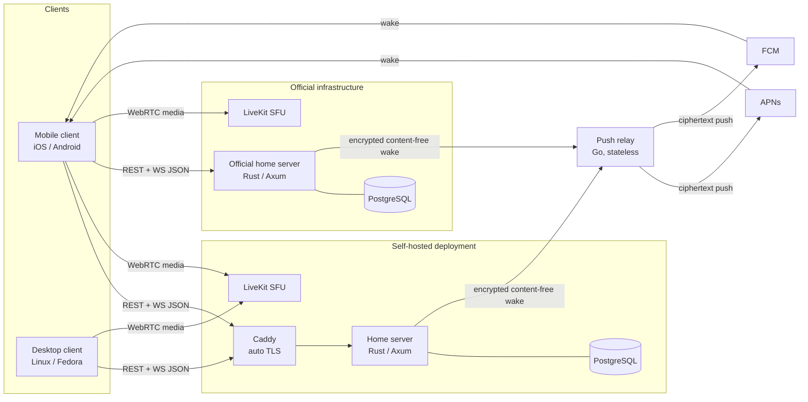

# slim-m Implementation Strategy

This is the single compiled pre-implementation strategy for slim-m, a lightweight, cross-platform, open source, Discord-style messaging platform with optional self-hosting.
It merges the founding [project brief](BRIEF.md) with fifteen specialist domain reports and their adversarial reviews under [research/](research/).
Where two domains disagreed, this document makes the call and records why, so a contributor who has never read the research can build from this file alone.
The brief is the contract, and its priorities win conflicts.

The working name "slim-m" is a placeholder; the final name is undecided.

## Executive Summary

slim-m recreates the core Discord experience (group chats and direct messages with text, voice, and screen sharing) around three non-negotiable priorities from the brief: performance as a first-class feature, extreme self-hosting simplicity, and an infinite collaborative Voice Canvas during calls as the signature feature.
The client is a Flutter application targeting iOS, Android, and Linux (Fedora GNOME Wayland), with iOS and Linux as the primary early test targets.
The main server is Rust (Axum, SQLx, PostgreSQL); a separate Go push relay, extended from the existing check-in-relay project, exists only to wake mobile devices, never to route messages.
Real-time voice, video, and screen share run through a self-hostable LiveKit SFU, kept strictly separate from the chat and canvas data planes.

The architecture is deliberately conservative where a proven pattern exists (Rust server, LiveKit, PostgreSQL, opaque session tokens) and deliberately careful where the reference project echo-messenger left scars.
The single most important lesson carried forward is event ordering: every persisted event across the whole system is assigned one global 64-bit snowflake identifier that is also its total-order key, replacing echo's unordered receive-time application that provably diverged.
The second is a per-object canvas data model that supports move, resize, z-order, and undo, replacing echo's flat capped JSON arrays.
The third is honest security scoping: v1 is transport-encrypted (TLS 1.3) with the server holding plaintext, not end-to-end encrypted, because full E2EE is incompatible with the brief's stated needs (history, search, sync, server-side moderation) and with "lightweight."

This strategy resolves every critical and major finding raised by the adversarial reviews.
The most consequential resolutions: snowflake IDs replace the per-conversation sequence counter that two sibling reports rejected; opaque server-side session tokens replace JWTs so bans and device revocation take effect instantly; camera bubbles and screen-share tiles stay ephemeral (never persisted) to settle a direct contradiction between the media and canvas reports; the production docker-compose gains LiveKit and a resolved port strategy so voice actually works as documented; and the invite-based account model gains a mandatory in-app account-deletion verb, report, block, moderation tooling, and an 18+ rating to pass App Store and Play review.

## Product Scope

### v1 includes

- Group chats and direct messages with text messaging, reactions, and message history.
- Voice calls and screen sharing in both group channels and DMs, over a self-hostable LiveKit SFU.
- The Infinite Voice Canvas during calls: freeform drawing, pasted images and GIFs, movable and resizable windows, floating camera bubbles, and floating screen shares, all arranged in one shared world-coordinate space.
- An official hosted instance and fully self-hosted servers, both running the same server image.
- Invite-link and invite-code account creation on self-hosted servers with no email verification, plus standard account creation on the official instance.
- An official Go push relay for mobile push notifications and background wake-ups, carrying only encrypted, content-free payloads.
- Multi-device per user, treated as an explicit day-one requirement.
- Administration tooling: user management, invite management, roles and permissions, diagnostics, logging, moderation queue, health monitoring, and performance metrics tracked over time.
- In-app report, block, and account deletion, always visible client-side.
- Procedurally synthesized notification sounds committed alongside their generator scripts.
- Docker-first deployment: an official GHCR multi-arch image, a production Dockerfile, and a production docker-compose example.
- Linux artifacts (AppImage primary, rpm alongside) and an iOS TestFlight pipeline.

### v1 explicitly excludes

- End-to-end encryption of messages, canvas content, or group media; v1 is transport-encrypted only, with per-user and per-device identity keys pre-wired so opt-in E2EE DMs can be added later without a wire-format rewrite.
- Flutter web and macOS/Windows desktop as supported targets; the wire format and permission bitset are nonetheless designed to remain safe if web is ever added.
- Multiple independent communities hosted under one backend deployment; one home server is one community in v1.
- Federation between servers in the Matrix or ActivityPub sense; clients connect directly to a chosen server.
- H.264, AV1, and VP9 SVC video codecs; v1 ships Opus audio and VP8 simulcast only.
- Client-side video effects and background blur.
- A relay-side devices database, message proxying, fan-out, dedup, or badge counting; the relay stays a stateless forwarder.
- Multi-process horizontal scaling of a single home server as a shipped default; the snowflake ID scheme and connection hub are designed to allow it later, but v1 ships single-process.
- Read receipts visible to other users (own-device read-state sync is included); this is deferred pending an owner decision.
- A foundation, steering committee, or CLA; governance is single-maintainer with a documented path to add maintainers, and provenance is DCO sign-off.

## Architecture Overview

The client talks to exactly one home server at a time over REST (request/response) and a single JSON-over-WebSocket gateway (real-time events).
Voice, video, and screen share never touch that gateway; they run as WebRTC media directly between the client and that server's LiveKit SFU.
When a mobile client is backgrounded or offline, the home server sends a content-free, encrypted wake event to the official relay, which forwards it via APNs or FCM; the woken client then connects directly back to its home server to fetch content.
The official instance is not special: it runs the same server and LiveKit images and registers through the same relay as any self-hoster.



Three data planes stay strictly separated: the chat/canvas control plane (REST + WS JSON), the media plane (WebRTC through LiveKit), and the wake plane (relay push).
Canvas objects reference a LiveKit participant or track identity as an opaque pointer only; media never flows through the canvas or WS channel, and content never flows through the relay.

## Key Decisions

### Flutter Client

Decision: a Melos-managed monorepo of small path-dependency packages (design_system, data, platform, rtc, voice_canvas, app), feature-first inside each, with a CI-enforced 300-line file budget.
State management is Riverpod with code generation (Notifier/AsyncNotifier), which is also the dependency-injection mechanism; there is no second DI container.
Navigation is GoRouter with shell routes for the persistent sidebar and small, independently tested redirect guards.
Local storage is Drift (SQLite) as the single source of truth for conversations, messages, channels, reactions, and canvas cache, with flutter_secure_storage for keys.
See [research/flutter-client.md](research/flutter-client.md).

Hot-path rule (resolves the flutter-client critical finding): Drift persists and hydrates only.
The 60fps canvas paint layer is fed by an in-memory spatial index plus a plain off-Riverpod ChangeNotifier, never a Riverpod StreamProvider watching a Drift query.
The same off-Riverpod pattern governs every high-frequency surface: drag data, typing previews, and avatar/cursor moves.
Every write path into Drift (WS push and REST catch-up) uses idempotent upsert-by-snowflake-id so a reconnect race cannot duplicate or reorder rows.

Ownership fixes required by review: a named `rtc` package owns the LiveKit Room/client wrapper (echo's highest-complexity subsystem) behind an explicit public API with a Room-injection seam so voice can be tested without a live SFU.
The `platform` package owns per-OS integration behind abstract interfaces; the iOS side includes a minimal native Swift PushKit/CallKit delegate because cold-launch VoIP reporting must run before the Flutter engine is alive.
Settings/account, moderation (report/block), and admin screens are first-class screens with owning packages and test coverage, not afterthoughts.

Rejected alternatives: a single layered package (echo's original shape, no compiler-enforced boundaries); Bloc and GetX for state (event boilerplate and global service-locator testability problems); get_it/injectable (a second competing graph resolved by runtime type); Hive/Isar/ObjectBox for storage (unmaintained, wound down, or native-binary heavy).

Accepted risks: multi-package builds and two stacked codegen tools (Riverpod + Drift) add setup overhead and occasionally opaque generated errors, mitigated by a small package count, path-only dependencies, and running both generators together.
The device identity key is stored via flutter_secure_storage, which is Keychain/Keystore-backed, not Secure Enclave non-extractable key generation; v1 accepts this, and true Secure Enclave key generation is scoped as future native work to land with opt-in E2EE.
Impeller maturity differs by platform (more proven on iOS than Linux) and is verified per platform at startup.

### Server Language and Framework

Decision: Rust with Axum, SQLx, and PostgreSQL for the main server; Go for the push relay, extended directly from check-in-relay.
See [research/backend.md](research/backend.md) and [research/networking-relay.md](research/networking-relay.md).
The module layout is auth/, ws/ (hub, handler, per-kind events), routes/, db/, push/, moderation/, admin/, config/, observability/, keeping policy out of transport code.

Rationale: a no-GC, long-lived, stateful WebSocket hub fits Rust; SQLx compile-time query checking would have caught echo's real JSONB i32/i64 production bug; the owner already has a mature Rust toolchain and CI.
The relay's job (stateless opaque-token forwarding, single static distroless binary) is exactly what check-in-relay already does, so extending it is lower-risk than a Rust rewrite.

Rejected alternatives: Go for the main server (weaker type safety for a stateful hub, and the security report's Go-specific govulncheck gate does not apply once the server is Rust); Elixir/Phoenix and Node/TypeScript (new paradigm or weaker efficiency/type safety); a Rust relay for uniformity (unnecessary weight for a deliberately dumb forwarder).

Accepted risks: two languages double the toolchains and CI pipelines and add a third ecosystem alongside Dart; this is accepted as the right tool for two genuinely different service shapes, consistent with the brief's explicit deprioritization of development cost against long-term maintainability.
The Rust server is gated in CI by cargo-audit and cargo-deny; govulncheck and OSV-Scanner are scoped to the Go relay only (resolves the security review's misattributed Go-only gate).
The v1 connection hub is single-process (in-memory), designed behind a swappable interface so a future fan-out backplane can be added for the official instance; multi-process operation is an explicit open question, not a silent assumption.
SQLx uses committed .sqlx offline mode, verified in CI with `cargo sqlx prepare --check` so migration-induced query drift is caught.

### Protocol and Sync

Decision: JSON over a single WebSocket envelope (op, type, data, id), with any binary payload carried as a base64 string inside it, never a separate binary frame.
Message identity and total ordering use one global server-generated 64-bit snowflake ID for every persisted event of every kind, including canvas ops and reactions.
This supersedes both the per-conversation `seq.rs` counter proposed by the backend report and the per-channel seq counter proposed by the canvas report.
See [research/realtime-sync.md](research/realtime-sync.md) and [research/database.md](research/database.md).

Snowflake layout reserves a small node-id field (defaulting to zero for single-process self-hosted deployments) so scaling the official instance past one writer process, or running two processes briefly during a rolling deploy, needs no breaking ID migration (resolves the realtime-sync and database node-bit findings).
A backward-clock guard enforces monotonicity.
Catch-up is one global cursor endpoint, `GET /api/sync?after=<id>&kinds=...`, returning a chronologically ordered page across every conversation, so a mobile reconnect is one round trip rather than N.
Read state is `last_read_message_id` per (user, conversation) with GREATEST-based monotonic updates and unread counts derived on demand via a single grouped aggregate, never a mutated counter.

Gateway lifecycle: ticket-based auth on connect (the credential is minted from the opaque session token, never placed in the WS URL), a 30s heartbeat, bounded per-connection channels that close rather than block on overflow, and stateless reconnect-and-resync via the sync cursor as the baseline.
A 90s in-memory resume window is an optional optimization to be validated against real iOS/Android background-suspension behavior before it ships, not a day-one requirement, since the stateless sync cursor already covers correctness (resolves the realtime-sync resume finding).
Ephemeral events (typing, presence, canvas preview frames, avatar/cursor moves) are never persisted, ride a separate relay-only channel, auto-expire client-side, and are coalesced (latest-per-actor) before any buffer overflow so a multi-participant drawing session cannot force disconnects on a slow receiver (resolves the bounded-channel finding).
Typing and presence auto-expire client-side after 8 to 10 seconds rather than relying on explicit stop events.

Protocol version negotiation happens on WS connect: client and server exchange supported protocol versions and capability flags, so a fleet of independently versioned self-hosted servers stays compatible with one official client release, and the client's Drift cache schema is versioned independently (resolves the database schema-propagation finding).

Rejected alternatives: Protobuf and msgpack (codegen and debuggability cost for a small team; voice never touches this channel so bandwidth is not the bottleneck); client-generated ULIDs (reintroduce the multi-writer ordering ambiguity that caused echo's canvas divergence); per-conversation catch-up (N+1 round trips on mobile).

Accepted risks: JSON decode CPU could matter at very large public-instance scale; this is profiled and revisited rather than pre-optimized.

### Database

Decision: PostgreSQL only, for both the official instance and every self-hosted instance, with no SQLite option and no dual-backend abstraction.
See [research/database.md](research/database.md).

Rationale (restated honestly per the database review): the schema genuinely needs row-level locking, JSONB with GIN, generated tsvector columns, partial indexes, and real write concurrency for bursty canvas sessions, and a single engine keeps SQLx's compile-time checking and the test surface intact.
The rationale is operational and feature-driven, not a claim that SQLite's locking granularity caused echo's bug; that bug was an app-level counter TOCTOU, now removed by snowflake IDs.

Schema commitments that the reviews forced:

- Full role-based access control: `roles`, `member_roles`, `channel_role_overrides`, and `channel_member_overrides` tables, replacing any single scalar role column, so the permission evaluator can union member roles with per-channel and per-member overrides (resolves the database permission critical).
- A `devices` table (id, name, push_token_ref, voip_push_token_ref, push_public_key) plus a separate `sessions`/`refresh_tokens` table (token_hash, device_id, family_id, revoked_at) so device revocation and refresh-reuse detection are actually implementable (resolves the devices-table major).
- A `reactions` table with the same snowflake-ordering treatment as messages, since realtime-sync names it a first-class synced kind (resolves the missing-reactions major).
- `attachments` content-addressed by sha256 with UNIQUE(sha256), an explicit hash-before-encrypt order, and an is_encrypted column mirroring messages (resolves the attachment dedup major).
- `canvas_ops` carries an is_encrypted/opaque-payload column mirroring messages, defaulting to plaintext for v1, so the canvas is not silently a permanent unencrypted audit log with no forward path (resolves the canvas privacy critical).
- Account deletion is a first-class path: `users` gains a deleted_at/anonymization column, every referencing table declares explicit ON DELETE behavior, group ownership transfers on owner deletion, and message content is purged while tombstone rows remain for thread integrity (resolves the deletion critical shared with App Store compliance).

Ordering is one global snowflake ID as primary key and total order.
Pagination is keyset on id, never OFFSET/LIMIT, backed by a partial index (channel_id, id DESC) WHERE deleted_at IS NULL that also serves unread counts.
Full-text search is a generated tsvector GIN column on messages.content, partial WHERE is_encrypted = false, with an explicit `simple` configuration default and optional per-server language override.
Migrations are forward-only sqlx migrate files; the official instance additionally documents concurrent-index and additive-backfill patterns so a long migration cannot be killed mid-run by a container health check.
Attachments are stored as encrypted blobs under a server key with the DB holding only metadata and a storage key.

Rejected alternatives: SQLite-first self-host (weaker concurrency exactly where correctness matters, and a second query surface forever); Elasticsearch/Meilisearch for search (too heavy for the lightweight bar); storing blobs as BYTEA (bloats vacuum, backup, and replication).

Accepted risks: the self-host floor is two containers (server plus Postgres) rather than one embedded file, mitigated by a tuned postgresql.conf under 80MB idle and single-command compose onboarding; autovacuum settings are stated explicitly rather than left as a side effect of memory tuning, since read_states and canvas_ops are bloat sources.

### Media Stack

Decision: self-host LiveKit (Apache 2.0, Go, official Docker image) as the SFU for voice, video, and screen share, with the official Flutter SDK across iOS, Android, and Linux.
Launch codecs are Opus audio and VP8 simulcast video only; H.264 hardware encode and AV1/VP9 SVC are deferred until device telemetry justifies them.
See [research/media.md](research/media.md).

Deployment: a single-node LiveKit container, no Redis, in the production compose stack.
The port-443 contention flagged by the media and devops reviews is resolved explicitly: Caddy owns 443 for the REST/WS API, and LiveKit's TURN/TLS runs on its own documented port (with UDP media range) plus firewall notes for the simple self-host default; SNI passthrough or a second IP is documented as an advanced option.
The compose file does not claim a 443-only deployment.

Coordinate and object rules: camera bubbles and screen-share tiles store position, size, and z-order in absolute world-space double-precision coordinates (the same space as strokes), never viewport-relative pixels, which structurally avoids echo's screen-share snapping bug without a normalization shim.
Media and canvas planes stay separate: a canvas object references a LiveKit participant/track identity as a pointer only.
Subscription binding ties LiveKit adaptiveStream/dynacast to canvas zoom and fully unsubscribes tracks outside the viewport, with a hysteresis margin and debounce so panning near the boundary does not flicker or thrash keyframes.

Security and lifecycle fixes required by review: LiveKit room access uses short-TTL capability tokens minted server-side per join, scoped by the same permission flags as everything else (this is a distinct capability system from slim-m's own opaque session tokens, reconciled below).
A kick or ban calls LiveKit's room-service API to forcibly evict the participant immediately, not merely block future token minting.
A pre-expiry token re-mint and handoff is designed for mid-call signaling reconnects so a network handoff does not silently drop a participant.
VoIP tokens live in the home server's `devices` table, not the relay.

Capture caps: camera at roughly 640x480 to 960x540 with Opus DTX; screen share gets its own explicit resolution and bitrate ceiling rather than being costed as "just another camera stream"; decode-side cost of several concurrent VP8 streams on iOS (no hardware VP8 decode) is measured against the canvas render budget before VP8-only is treated as low risk.

Rejected alternatives: custom Pion/ion-sfu or mediasoup (own a media engine, no or unofficial Flutter SDK, or a second Node runtime); Janus and Jitsi (DIY room model or three coordinated services); P2P mesh (does not scale past a few participants).

Accepted risks and honest disclosure: group call media is decrypted at the SFU and is therefore visible to the server operator by design, stated plainly here to match the security report's disclosure, since group calls are a primary use case.
iOS ReplayKit's roughly 50MB broadcast-extension memory ceiling and Linux flutter_webrtc PipeWire/Wayland maturity are real risks, de-risked by an early Fedora validation spike before deep canvas investment.
An aggregate egress bandwidth budget for a handful-of-users video room is load-tested alongside CPU and RAM.

### Voice Canvas Sync and Rendering

Decision: a per-object row model (`canvas_objects`: id, kind, z_index, transform, props, id-as-order) replacing echo's flat capped JSON arrays, materialized from an append-only `canvas_ops` log.
See [research/voice-canvas.md](research/voice-canvas.md).
The canvas exists only during a live voice call, so the sync model is server-authoritative last-write-wins by snowflake order, not a CRDT.

Ordering: the canvas uses the same global snowflake ID as every other event; there is no separate per-channel counter (resolves the canvas ordering critical by adopting the database/realtime-sync scheme).
Clients apply strictly by id, never by WebSocket arrival order, which eliminates echo's clear-resurrection, image-move-race, and late-joiner double-apply bugs.

Presence versus content (resolves the direct media-versus-canvas contradiction): strokes, images, GIFs, and windows are persisted; camera bubbles and screen-share tiles are ephemeral presence objects that are never written to the persisted op log and reset on rejoin.
All object types share one world-coordinate space and one render list, merged in memory at paint time; the z-order merge rule is defined explicitly so persisted `z_index` and the in-memory presence z-counter cannot diverge, and presence z resets on reconnect while content z is replayed from the log.

Object streaming (resolves the panning critical): a viewport-delta subscription protocol streams objects for the visible region and its updates; late-join fetches a materialized snapshot of the visible region, and panning triggers incremental region fetches, so a 20,000-object world is fully reachable rather than only the join viewport.
Canvas reconnect discards local canvas state and re-fetches a fresh materialized snapshot rather than replaying raw ops across a clear/delete (resolves the catch-up finding).

Rendering: echo's pointer-count gesture state machine and three-layer RepaintBoundary split are reused, adding spatial-grid culling plus two layers for images/windows and for presence video textures.
The presence video layer wires to LiveKit subscribe/unsubscribe via a track-reference field in the object props (resolves the canvas/LiveKit integration major).
"Infinite" is implemented as a very large bounded double-precision world (plus or minus roughly 5,000,000 logical pixels) with client-side recentering at extreme pan distances, matching how Figma and Miro work; the literal-infinity interpretation is disclosed as an intentional deviation and raised as an owner open question.

Undo, caps, and authorization: undo emits a new inverse op rather than rewriting history, and is restricted to the object's author or a member with moderate permission, since any-member undo would let anyone revert others' or admins' work (resolves the undo authorization major).
Object growth uses a surfaced soft cap (target smooth performance to roughly 5,000 objects on iOS and 20,000 on Linux) plus a high hard ceiling with a clear error, never a silent drop like echo's 2,000-item cap (resolves the missing-ceiling major).
Image and GIF memory uses a bounded LRU decoded-bitmap cache (96MB iOS, 256MB Linux) with a mip-tier swap and a hard cap of 8 concurrently animating GIFs.
Canvas rate limits are split: a strict per-user persisted-op cap and a separate, much higher byte-rate cap for ephemeral relay-only preview frames, so an actively dragging user is not disconnected mid-stroke (resolves the flat-rate-limit critical).
Collapsing the canvas to a thin strip for voice-only participants unmounts and suspends the spatial-index query and paint layers rather than merely resizing them, and voice-only has a separate lower CPU/battery budget (resolves the collapse finding).

Accessibility: the canvas cannot be made fully screen-reader equivalent; the disclosed fallback is a text-based canvas activity log.

Rejected alternatives: keeping the flat-array model with a bigger cap (only delays the migration echo already recommended); CRDT (solves offline multi-writer merge the canvas never needs); per-object server-side locks (disproportionate complexity for a rare collision during a live call); arbitrary-precision coordinates for true infinity (unjustified for a chat whiteboard).

Accepted risks: op-log growth is bounded by a compaction/archive job at roughly 30 days, with rows tied to open moderation reports exempt so evidence is not lost; the day-one tuning (mip-tier cache, GIF caps, 20,000-object target) is validated by a de-risking spike and adjusted to real telemetry rather than shipped blind.

### Security and Account Model

Decision: TLS 1.3 plus DTLS-SRTP is the mandatory v1 baseline; end-to-end encryption is deferred, with per-user X25519/Ed25519 and per-device keys pre-wired so opt-in E2EE DMs and multi-device key cross-signing are addable later.
See [research/security.md](research/security.md).
Full Signal-style E2EE is rejected for v1 because it breaks history, search, sync, and server-side moderation, and is not "lightweight"; the self-hosting trust model already places the operator inside the content boundary.

Sessions and auth: opaque server-side session tokens (short access, rotating refresh bound to device_id with reuse detection, stored only as SHA-256 hashes), backed by revocable device-session records.
This replaces the backend report's JWT proposal so admin bans and device revocation take effect instantly with one indexed query (resolves the auth critical shared by backend and realtime-sync).
Passwords use Argon2id at 19 MiB, but concurrent Argon2id evaluations are bounded by a semaphore sized to the memory budget so a burst of unauthenticated logins cannot OOM the server under a 150MB limit (resolves the Argon2id OOM major).

LiveKit reconciliation: LiveKit genuinely requires a JWT for room access, so the "no JWT" stance applies to slim-m's own user auth only.
LiveKit room tokens are a separate, short-TTL capability system whose grants (connect, publish audio, publish video, screen share) are derived from the permission bitfield, with room-id derivation, per-role scoping, and rejoin nonces documented (resolves the LiveKit-authorization major).

Transport trust, scoped honestly (resolves the identity-pinning critical): v1 uses standard CA TLS 1.3 via Caddy auto-TLS.
A long-lived Ed25519 server identity key, persisted in a compose volume and pinned by the client via the invite fingerprint, provides server-identity continuity (trust-on-first-use, detecting a server changing identity), and is explicitly not claimed as an active-MITM defense, because with TLS terminated at Caddy the client's signature cannot be channel-bound.
Identity-key rotation is a signed mechanism (new key countersigned by the old), and the client UX distinguishes legitimate recovery from an attack rather than training users to click through mismatches (resolves the key-lifecycle major).

Permissions: role-based flags in a bitfield resolved by one pure deny-by-default evaluator (@everyone, roles, channel overrides, member overrides), authorizing every action server-side including each Voice Canvas mutation.
The wire format carries the flag set as a string or byte-array bitset, not a raw JS-double-limited integer, so a future flag past bit 52 is safe if Flutter web is ever targeted.
Optimistic canvas mutations have a defined reject-and-rollback contract keyed by op id, separating one-time session capability checks from per-op shape validation (resolves the optimistic-render minor).

At-rest scope, stated honestly (resolves the at-rest major): v1 encrypts attachment blobs at rest under a server key and documents operator-managed volume/disk encryption as the defense against raw backup theft.
Message text remains plaintext in Postgres and the blob key is co-located, so v1 does not claim confidentiality against an attacker holding both the database and the host; real external key separation is future work.

Multi-device (resolves the multi-device-key major): per-device keypairs exist from day one for push encryption and future E2EE, with a user-level identity that will cross-sign device keys when E2EE lands; multi-device is an explicit day-one requirement, not a retrofit.

Abuse controls: layered token-bucket limits, in-process by default and injectable to a shared store for the official instance, covering per-IP and per-account login throttling, invite throttling, per-user message and canvas caps, and a per-device relay wake cap plus a tighter call-push cap.
The official instance persists or centralizes lockout across replicas and adds an IP-independent step-up (proof-of-work on repeated failures) rather than relying on per-IP throttling alone against IP-rotating credential stuffing.
Attachment safety validates by magic bytes, caps size and pixels, strips EXIF, serves from random keys with attachment disposition and nosniff for any web surface, and disables server-side link unfurling by default; the native client additionally applies dimension and memory decode budgets before decoding attacker-supplied images, since CSP and Content-Disposition do not protect a native decoder.

Account model and App Store adjustments (detailed in the compliance section below): invite links carry a 128-bit token plus server address and identity fingerprint; short human codes are strictly throttled; the app adds mandatory in-app report, block, and account deletion, a terms-of-use gate at invite redemption, and an 18+ rating.

Rejected alternatives: stateless JWTs (un-revocable, alg-confusion footguns); TLS certificate pinning (breaks on rotation); self-signed certs on mobile (hostile under App Transport Security); CAPTCHA as the primary abuse defense (heavy, privacy-hostile).

Accepted risks: a malicious operator or a breach of both DB and host exposes stored messages, mitigated by attachment-blob encryption and documented volume encryption; traffic-analysis timing remains visible to the relay operator, with batching and jitter deferred; on the official instance one operator runs both server and relay, so the relay-versus-server metadata boundary is real only for self-hosted deployments, stated plainly.

### Push Relay

Decision: extend check-in-relay's per-server scoped-key model; one key authorizes both FCM and APNs via a per-message platform field, and the official instance routes through the same relay path.
See [research/networking-relay.md](research/networking-relay.md).
The relay stays a stateless forwarder: it holds no devices table, and home servers pass opaque tokens on every send, rejecting the brief's literal ask for relay-side per-user device persistence because it would duplicate the home server's registry and widen metadata exposure.

Provider path: add a direct APNs HTTP/2 path using Apple's token-based .p8 auth key alongside the FCM path, with a separate APNs voip topic for calls and a unified result mapping (UNREGISTERED versus 410/BadDeviceToken) so callers prune consistently.

Payload privacy (resolves the plaintext-preview contradiction between networking-relay and realtime-sync): the payload is always encrypted to the device's push key and carries only a coarse kind (message, mention, call, wake); no plaintext title or body ever reaches the relay, APNs, or FCM.
The home server, which holds plaintext in v1, encrypts the notification to a domain-separated per-device push subkey using a sealed-box/HPKE construction (not the raw identity key), and the iOS Notification Service Extension decrypts on-device with a generic fallback alert; Android uses data-only FCM messages so the app builds the notification itself.
realtime-sync's "short plaintext preview in the push payload" is overridden by this decision.

Token-harassment fix (resolves the unrevocable-token critical): each device push token is bound to the key that first registered it, and cross-key sends for that token are rejected, closing the standing-harassment vector without building a relay devices table.

Reachability (resolves the NAT critical): WAN reachability is a documented hard precondition for push; a self-hosted server behind NAT with no port forward uses the home server's PushSender disable path instead of registering for an unfulfillable wake, and onboarding surfaces a reachability check.

Call routing (resolves the CallKit-scope major shared with App Store): the call kind uses PushKit VoIP plus CallKit and applies only to 1:1 calls and explicit call invites, never to joining an already-active persistent voice channel, which would otherwise ring every member's phone.
Every VoIP push must synchronously report to CallKit as a mandatory invariant with explicit regression-test coverage, and the VoIP push reports a generic incoming call first, reconciling caller identity after connecting, rather than routing through the NSE decrypt model that VoIP pushes bypass (resolves the security call-path major).
A per-server call-push mute and reputation limit defend against a hostile fork harassment-bombing a victim's CallKit (resolves the App Store call-abuse major).

Throughput: the current fully serial send loop is replaced with a bounded worker pool, but with a hard per-request deadline returning partial results (or accept-and-poll for large batches) so a 500-token batch cannot become a multi-minute synchronous HTTP response (resolves the worst-case-latency major).
Rate limiting is documented as single-instance-only or made injectable for a future shared store; a global registration ceiling plus aggregate-volume monitoring against the shared FCM project and APNs Team ID defend against IP-rotation abuse that could trip provider-side throttling for all self-hosters (resolves the shared-credential majors).

Rejected alternatives: separate per-platform keys (unneeded since a server has both credentials or neither); continuing to rely on FCM's APNs bridge (added latency and no access to VoIP push types); a relay-side devices/subscriptions schema (only needed if the relay ever takes on fan-out).

Accepted risks: routing official-instance traffic through the relay adds a network hop, accepted for code-path simplicity; send timing and volume remain visible to the relay operator; long-term dependence on APNs/FCM staying free is a low-probability platform risk noted as an assumption.

### Repo Structure and Licensing

Decision: two repositories.
A core monorepo holds the Rust server and the Flutter client (so client/server wire-protocol changes land atomically), and a separate repo extends check-in-relay for the Go relay (different language, cadence, and secrets trust boundary).
See [research/oss.md](research/oss.md) and [research/devops.md](research/devops.md).

Licensing: AGPL-3.0 for the server and the relay (the network clause stops a rehoster running a competing SaaS without contributing back), Apache-2.0 for the Flutter client and the shared protocol definitions (no SaaS-rehosting risk on client code, and AGPL on app-store binaries has caused real friction; Apache-2.0's patent grant beats MIT).
echo's PolyForm Noncommercial license is not carried forward, since it is source-available rather than OSI-open and contradicts the brief's open-source principle.
check-in-relay needs a LICENSE file added as part of the fork, since it currently has none.

Cross-repo contract discipline (resolves the oss majors): the server-relay push envelope (kind, platform, ciphertext) is named as a second cross-repo contract on equal footing with the client/server protocol; it is versioned explicitly and guarded by a scheduled contract test exercising a real relay against the current server push encoding, so a silent mismatch cannot degrade to battery-draining client polling unnoticed.
The relay repo gets branch protection, maintainer-only review on credential-loading and admin-token paths, and its own MAINTAINERS.md and CODEOWNERS, since it is the higher-trust component.
A per-crate license-field CI check plus license-aware review on the shared crate prevents AGPL logic or AGPL-only dependencies leaking into the Apache-2.0 protocol crate.

Provenance and workflow: DCO sign-off (bot-enforced), not a CLA, since no dual-license business model is stated; conventional commits via commitlint plus lefthook; dev/feature/fix branches to main; path-gated CI.
Governance is single-maintainer today, formalized via MAINTAINERS.md and CODEOWNERS with a documented criteria-based path to add maintainers; no foundation yet.
docs/research/ stays as living specialist reports and docs/decisions/ is added as a decision-of-record folder, with a PR gate requiring doc updates for any documented contract change.

Componentization guardrails: the 300-line file budget is a CI-enforced lint rule, a custom_lint rule enforces the Result-type discipline at repository boundaries, and package/workspace boundaries plus CODEOWNERS are the primary enforcement.
The Melos multi-package client split is treated as a real first-time build with no precedent in echo's single-package client, not a "reuse," and its minimal-first subset (see roadmap) ships before the full test scaffolding.

Rejected alternatives: one repo including the relay (secrets exposure); three fully separate repos (two-PR choreography on every protocol change); Apache/MIT for the server (gives up the anti-rehosting lever); GPL-3.0 (has the SaaS loophole AGPL closes); a CLA now (friction not justified without a stated dual-license goal).

Accepted risks: the core repo grows large over years (echo already carries large debt and research docs), mitigated by path-gated CI, actively maintained workspace boundaries, and a named recurring maintenance practice rather than assumed discipline; introducing a CLA later if a commercial offering emerges is harder than starting with one, accepted given no such goal is stated.

### CI/CD and Releases

Decision: reuse the shape of a path-gated dev-build and release pipeline, but treat path-gated CI, iOS release CI, and cross-arch publishing as new builds rather than ports, because direct inspection shows the reference repos do not actually contain a dev-build workflow, dorny/paths-filter usage, an iOS release job, or fastlane match/pilot (they use raw altool with manual certs).
See [research/devops.md](research/devops.md).
This honesty resolves the devops "proven reuse" critical; the working altool approach is evaluated before committing to fastlane match.

Versioning: release-please in manifest mode with component paths for server and client and a linked-versions group, so client and server share one version and change the protocol atomically; the relay is independently versioned in its own repo.
A client-only change still bumps the shared client/server version, accepted as harmless and documented in CONTRIBUTING.md, because keeping their protocol versions aligned is the point (resolves the cross-component-bump major).

Multi-arch: publish linux/amd64 and linux/arm64 for server and relay, building Rust natively on arm64 runners and structuring both the server and relay Dockerfiles with `FROM --platform=$BUILDPLATFORM` and `ARG TARGETARCH` driving the target so buildx does not silently fall back to slow QEMU compilation (resolves the QEMU major).
The production image is a two-stage musl plus rustls static build on distroless nonroot, targeting under 20MB compressed, under the backend 40MB ceiling.

Production compose (resolves the missing-LiveKit critical): server, postgres (small-instance tuned), Caddy for automatic TLS, and LiveKit, with the port-443 contention resolved as described in the media section and documented in the compose file and deployment docs.

Supply chain and release safety: cosign keyless signing plus SLSA provenance across Docker images, AppImage, and rpm, with a conventional GPG signature and SHA256SUMS alongside; CycloneDX SBOM generation per release; SHA-pinned GitHub Actions; gitleaks; and reviewer-gated GitHub Environments on every job holding GHCR, TestFlight, signing, or match credentials (resolves the SBOM/pinning/environment major).
The official instance deploys via an explicit deploy step gated on the release-PR merge, not watchtower auto-update from :latest, for controlled, verifiable rollouts; self-host docs offer optional opt-in watchtower (resolves the deploy-mechanism major).

Linux artifacts: AppImage primary (runs unmodified on Fedora), rpm alongside; .deb and flatpak deferred post-1.0.
iOS: every tagged release produces a TestFlight build regardless of the dev-build cost gate; v1 TestFlight distribution stays internal-only to avoid Apple Beta App Review.

Performance CI is a two-speed system (detailed under budgets): per-PR criterion and client-baseline diffs with median-of-N runs and a minimum frame-count floor to avoid flaky jank gates; periodic full load, real-device (or explicitly simulator-only, with the gap accepted), and idle soak jobs.

Rejected alternatives: semantic-release and echo's hand-rolled tag script (neither branches on commit type as the brief requires); QEMU emulation for Rust (5 to 10x slower); Traefik by default (Caddy is simpler for a single-instance self-hoster, with a documented Traefik fallback); bundling Prometheus/Grafana by default (too heavy).

Accepted risks: a real-device-only iOS regression can sit in main until the periodic job catches it, an explicit accepted gap; arm64 GitHub runners are new to this team (zero prior operational history, stated as such, not merely "less").

### UX and Design Direction

Decision: one home server is one community, so the leftmost rail is both account switcher and community switcher, with channels and DMs in one sidebar beneath it.
See [research/ux.md](research/ux.md) and [research/design-language.md](research/design-language.md).
Layout is responsive by window width (Material compact/medium/expanded classes via a LayoutBuilder-driven adaptive shell), never by Platform.isX, so a resized Linux window or rotated iPad reflows live.

Visual direction: a neutral-first cool slate UI with one restrained teal accent, not a brand-saturated palette, in the durable lineage of Linear, GitHub, and VS Code.
Typography is IBM Plex Sans (variable) with IBM Plex Mono for code, weight capped at 600.
Elevation is border-first (1px hairlines, only two shadow tokens for truly floating surfaces), messages are flat and grouped rather than chat bubbles, and motion is short and functional in the chrome with the Voice Canvas as the deliberate expressive exception.
Restraint is scoped to the app chrome; the canvas is the zone allowed richer color and more energetic motion.

Design-token contrast must pass an automated WCAG 2.1 AA check in CI on the token file, and the review found several published values fail (resolves the design-language criticals): `border.subtle` computes to roughly 1.2 to 1.35:1 and must be darkened to clear 3:1 or paired with a sunken depth cue; the light accent `#2B8A83` computes to roughly 3.9 to 4.15:1 and must be retuned to clear 4.5:1 for body-text use; status and cursor colors currently have no defined hex and must be specified and checked; and cursors need a non-color differentiator (initials or name label) since color-only signaling is the exact problem the status-dot shapes already fix.
The published palette is therefore a starting point, not a locked token set; the CI contrast gate is the authority.

Accessibility is mechanically enforced: semantics labels on every widget, 48x48 minimum tap targets, WCAG AA contrast checked in CI, and text scaling verified by golden tests.
The authoritative font-scale target is 200 percent (WCAG 2.1 AA SC 1.4.4), which resolves the direct contradiction between the ux report's 200 percent, the design-language report's 130 percent, and design-language's own internal AA claim; flutter-client.md owns the golden matrix (light, dark, and true-black themes across two viewport widths at 100 percent and 200 percent font scale, on a pinned CI runner image), and the fixed three-pane layout gets a real reflow/scroll resilience plan at 200 percent.

Information architectures the reviews found missing are now in scope and owned: a settings/account IA (account deletion, device list, notification preferences), a moderation IA (report, block, moderation queue), and an admin console IA, none of which the original navigation model placed anywhere.

Interaction fixes required by review: haptics mark only deliberate user-caused transitions (mute toggle, drag pickup/drop, zoom-limit with a one-impact debounce), never passively received messages, and the "canvas authority claim" trigger is dropped because the sync model has no locking mechanism to fire it (resolves the ux haptic major).
The quick switcher is in-app-focused, since Wayland blocks true system-wide hotkeys without GlobalShortcuts portal integration, which is deferred; all shortcuts are user-remappable from day one because GNOME and tiling window managers reserve many combinations.
Manual server-address connections get an explicit fingerprint-confirmation step rather than silent trust-on-first-use, so the three onboarding entry points are not presented as equally trustworthy (resolves the onboarding major).
A terms-of-use acceptance step is added at invite redemption (required by Google Play's 2026 UGC policy).
Voice channels open a preview/roster state with an explicit Join button and mic/camera pre-toggles rather than auto-connecting, and joining opens voice and canvas as one screen that collapses to a thin strip without leaving the call.
The shared context menu component is named for the current API (UIContextMenuInteraction on iOS), not the deprecated peek-and-pop.

Presence scope (resolves the ux/realtime-sync critical): presence visibility follows channel-visibility (a user sees presence for channels they can view per the permission model), and for very large servers the sidebar shows a summarized, lazily fetched voice-participant count and first-N avatars rather than a full real-time broadcast to every member, with the fan-out cost budgeted in performance.
Client connection lifecycle is lazy-connect: a live WS is held only to the active server, and other joined servers rely on push wake plus periodic sync for their unread badges, with per-server resource cost budgeted.

Rejected alternatives: Discord's one-account-many-guilds model and a unified cross-server inbox that hides sender identity; Platform.isX branching; a fixed non-remappable keymap; auto-join-on-click for voice; separate join-call and open-canvas navigation steps; deriving dark mode by inverting light mode; a decorative display typeface; backdrop-blur frosted glass.

Accepted risks: one backend hosting multiple communities is unserved in v1 (revisit if self-hosters ask); near-zero chrome motion can read as lifeless, with the canvas as the intentional counterweight; the accent teal is a from-scratch brand choice pending a real designer review.

### Audio Design

Decision: numpy additive synthesis generates seven deterministic notification waveforms, pyloudnorm normalizes loudness, and committed WAVs plus their generator scripts live under assets/audio/notifications/ with a CI job that regenerates and diffs to enforce reproducibility.
See [research/audio.md](research/audio.md).
One shared bell-like timbre (inharmonic partials) unifies the family; sounds differ by pitch contour, note count, and duration, with join/leave a mirrored ascending/descending pair.
Character follows subtle Linux login sounds: fundamentals 400 to 1200 Hz, mono, soft attack, 150 to 500ms one-shots, a 30s-capped ring loop.

A shared synth.py module is extracted so all seven generator scripts import one implementation of partials, envelope, and normalization rather than duplicating DSP (resolves the shared-module major).
Loudness targets are -18 LUFS momentary for one-shots and -23 LUFS integrated for the ring loop, with an explicit whole-clip K-weighted RMS fallback for sub-400ms clips shorter than the momentary window, since pyloudnorm's public API exposes only gated integrated loudness (resolves the LUFS major).
"Normalized across operating systems" means consistent relative loudness within the family, not overriding the user's OS volume, stated explicitly so a quieter-on-Linux perception is not later filed as a bug.
To avoid cross-CPU floating-point drift breaking the byte-diff, the reproducibility check generates and commits WAVs from CI only, removing contributor-machine variance (resolves the FP-drift major).

Playback selection is on-device, not filename-in-payload, because the relay carries only encrypted, content-free payloads (resolves the audio critical): the iOS Notification Service Extension selects the sound after decrypting, mapping the four relay kinds to sounds; Android selects from the decrypted data message; the CallKit incoming-call ring is a separate bundled file owned by CallKit, scoped explicitly by platform and call direction rather than assuming the in-app player rings incoming iOS calls (resolves the call-ring major).
The iOS session uses the .ambient category so chimes respect the silent switch, and precedence rules suppress or defer in-app chimes whenever a LiveKit call already owns the audio session, so a chime cannot glitch a live call (resolves the audio-session major).
Android background sounds play through versioned Notification Channels (for example channel_message_v1) since a channel's sound is immutable after creation.
Linux notification sound is entirely foreground and app-owned over PipeWire, with no dependency on notify-send or desktop sound themes.
All masters are uncompressed mono PCM WAV, since the full set is under about 350KB and one format is simpler than a per-platform codec matrix.

Rejected alternatives: DAW-authored or sampled sounds (not reproducible from source); shipping numpy/pyloudnorm as an app runtime dependency (violates the lightweight principle); a distinct synthesis method per sound (breaks family cohesion); integrating libcanberra/freedesktop themes (inconsistent across desktops).

Accepted risks: three iOS integration paths (foreground player, NSE sound, CallKit ringtone) rather than one, mitigated by a CI bundle-check since a missing sound file fails silently to Apple's default tri-tone; default join/leave sounds are off above a small member-count threshold (a product decision left open) to avoid fatigue in busy servers.

## Performance Budgets

Performance is a first-class feature, so budgets are concrete, per-platform, and CI-tracked from Phase 0.
See [research/performance.md](research/performance.md).
Numbers are validated against real load and device tests before being locked, and a "mid-tier iOS device" is a concrete CI-pinned device reviewed yearly.

Client:

| Budget | iOS | Linux (Fedora) |
|---|---|---|
| Cold start | < 1.5s | < 1.2s |
| Warm start | < 500ms | < 500ms |
| Idle memory | < 150MB | < 200MB |
| Active-call memory | < 250MB | < 400MB |
| App/binary size | < 60MB | < 80MB |
| Steady frame rate | 60fps, < 1% jank frames | 60fps, < 1% jank frames |

Client additional budgets required by review (battery, network, and disk are all brief-named metrics that no report had bounded):

- Battery: measured via iOS Energy Log and Linux powertop/turbostat, with separate voice-only and canvas-active figures and a no-worse-than-10-percent-per-release regression gate.
- Network: a per-session bandwidth budget, with continuous canvas ephemeral traffic targeted near 20KB/s.
- Client disk: bounded local DB and cache growth with LRU eviction (the 96MB iOS / 256MB Linux decoded-image cache is the dominant term), plus an overall cache ceiling.
- iOS extensions: the Notification Service Extension budgeted well under its kill ceiling and the Broadcast Upload (screen share) extension under the roughly 50MB ReplayKit cap, each with its own Instruments-attach profiling step.

Server and self-host stack:

- Rust server idle RSS under 30MB at true zero load, under a 150MB light-activity ceiling (this reconciliation is authoritative; the backend report's 30MB and the canvas report's 150MB were the same number mislabeled).
- Postgres idle under 80MB with a small-instance-tuned postgresql.conf.
- Full self-host stack (server plus Postgres plus LiveKit) under 200MB RAM idle, under 800MB with a handful of active voice/canvas participants including one video room.
- Idle CPU effectively 0 percent, sampled in the periodic soak test, not only RSS.
- Per-persisted-event cost is split into two budgets so I/O is not conflated with CPU (resolves the mixed-metric critical): CPU-bound validate-and-fan-out p99 under 5ms, and I/O-bound commit latency tracked as a separate budget not gated identically on Pi-class hardware.
- Ephemeral event processing p99 under 50 microseconds.
- LiveKit small video room: 1 to 2 vCPU, under 500MB RSS, with an aggregate egress bandwidth budget load-tested for the handful-of-users profile.
- Server image under 20MB compressed.
- The built-in admin metrics store (a small Postgres time-series table: raw 24h, 5-minute averages 30d, daily averages 1y) has its own explicit RAM/CPU/disk budget measured against the idle targets it taxes, and the /metrics Prometheus endpoint requires auth or network isolation since it exposes sensitive throughput metadata.

The benchmark suite (criterion, a Rust WS load harness including the FTS/GIN write path, and Flutter FrameTiming/start-time harnesses) is built from the first working build, results versioned into one JSON baseline per release; the benchmark hot-path list uses snowflake ID assignment, not the superseded per-channel counter, and idle RSS is validated against the real musl release binary with an explicit allocator choice (jemalloc or mimalloc if musl fragments under Tokio).

## App Store and Play Compliance

The guideline analysis is sound in its verdicts, but the reviews found it overclaimed unbuilt infrastructure and understated child-safety risk; the resolutions below are the required, not optional, adjustments to the invite-based account model.
See [research/appstore.md](research/appstore.md) and [research/security.md](research/security.md).

Verdict: the invite-based, no-email account model is compatible with the App Store and Play, and does not trigger Sign in with Apple, provided the adjustments below ship in v1.
The official instance falls under the own-account-setup exception and self-hosted accounts under the client-for-a-third-party-service exception (the reading Mastodon and Matrix clients rely on), but slim-m bundles a marketed official account alongside third-party-server login in one app, a materially different shape, so this is treated as an open question backed by explicit App Review notes rather than settled precedent.
No third-party social login is added in v1, which keeps the Sign in with Apple obligation from ever arising.

Required adjustments:

- Account deletion is a mandatory wire-protocol verb implemented in the reference server from v1, always visible client-side, with a non-hiding fallback for third-party servers; deletion purges message content while retaining tombstone rows for thread integrity, anonymizes the user row, and transfers group ownership, reconciled against the append-only log so it satisfies substance, not just syntax.
- Report, block, and a moderation queue ship at launch, with published contact info, since both stores gate approval on their presence.
- A terms-of-use acceptance checkbox is added at invite redemption (Google Play 2026 UGC policy).
- The official app declares an 18+ rating under Apple's new tiers, plus a Google Play IARC questionnaire and target-audience declaration pass, given the unmoderated voice and self-hosted UGC surface.
- The relay call-push path (VoIP token schema, kind=call, synchronous CallKit report) is stated plainly as unbuilt v1 work and a hard dependency, not shipped behavior needing only a regression test; the CallKit synchronous-report invariant gets explicit test coverage because a miss is a compliance risk, not just a UX bug.
- Screen share budgets the iOS Broadcast Upload Extension against its 50MB cap from the first spike, declares Android mediaProjection, camera, and microphone as separate justified foreground service types, and re-prompts MediaProjection consent every session (Android 14 no longer caches it).
- Voice-call background modes use UIBackgroundModes voip with PushKit and CallKit only (never the audio background mode), and Android uses a phoneCall foreground service with a CallStyle notification and Telecom ConnectionService; the first-call full-screen-intent permission flow is designed explicitly with a tested heads-up fallback, since Android 14 does not auto-grant it to non-dialer apps.
- Push tokens are declared as Device ID data in both stores' privacy disclosures, and the app's own privacy policy carries an explicit publisher-visibility disclaimer for the unbounded set of self-hosted servers a user may connect to.
- A standing demo self-hosted deployment plus App Review Information notes are a release-checklist item, since the invite-only flow is otherwise untestable by a reviewer.

Child-safety and legal reporting (resolves the appstore critical, the single most store-dangerous gap): a dedicated CSAM and legal-reporting design pass is commissioned before v1, covering the official instance's reporting pipeline and hash-matching policy stance; the client verifies via a capability handshake that a server exposes report/block before connecting, and surfaces a warning if absent, since a third-party fork can strip moderation while the official app remains the access point.
The official instance states an explicit report-response target reconciled honestly against single-maintainer governance.

Flathub/OARS content-rating metadata for eventual Linux desktop distribution is noted now as future-scope so it is not rediscovered cold.

## Design Brief Prompt

The following is ready to submit to a dedicated design tool, drawn from [research/design-language.md](research/design-language.md).
One correction from the design review is folded in: the palette below is a validated starting point, and every foreground/background pair must pass an automated WCAG 2.1 AA contrast check (body text at least 4.5:1, borders and large text/icons at least 3:1), with values adjusted to pass; in particular the light accent must be darkened until it clears 4.5:1 on surfaces, and the subtle border must clear 3:1 or be paired with a sunken depth step.

```
Design a desktop-and-mobile UI for "slim-m," an open-source, self-hostable,
Discord/Slack-style group chat and voice app. Sidebar-based navigation
(one server = one community as both account and community switcher, channel
list, member list), a flat grouped message list (avatar, name, timestamp,
stacked text - no chat bubbles), and a signature "Voice Canvas": an infinite
collaborative whiteboard active during voice calls, with movable camera
bubbles, screen-share tiles, and freeform drawing, in the spirit of Figma
or a shared AR workspace.

Style: understated, clean, calm, functional, built to look good in five
years, not two. Neutral-first: cool slate-gray surfaces, restrained use of
a single teal accent, no purple/blurple, no heavy shadows, no glassmorphism
or blur, no gradients as decoration.

Palette (starting point; must pass WCAG 2.1 AA contrast, adjust to pass):
- Light: background #F7F8F9, surface #FFFFFF, border #E1E4E8 (darken until
  it reads at 3:1), text #1B1E22 / #5B6169, accent #2B8A83 (darken until it
  clears 4.5:1 on surfaces for body use).
- Dark: background #17191C, surface #1F2226, border #2B2F34,
  text #ECEDEF / #A7AEB6, accent #4FBDB4.
- Also produce a true-black variant for OLED.
- Status: green online, amber away, red do-not-disturb, gray offline, each
  with a distinct shape, not color alone.
- Canvas participant cursors: a categorical set spaced from accent and
  status hues, each with a name/initials label, never color alone.

Typography: IBM Plex Sans, weights 400/500/600 only, never bold 700.
Type scale 11sp to 24sp, message body 15sp, tabular figures for numerics.
Layout must remain legible and reflow cleanly at 200% OS text scale.

Spacing: 4dp grid (4/8/12/16/20/24/32/40/48/64). Radius: 4/6/10/16 plus
full for avatars and pills. Elevation via 1px hairline borders, not drop
shadows, except two subtle shadows for menus and floating windows.

Icons: consistent 1.5px-appearance stroke outline set (Phosphor-style),
20-24dp, bold weight for active state instead of color-only changes.

Motion: fast (100ms) micro-feedback, base (180ms) panel transitions,
nothing over 280ms in the chrome; respect OS reduce-motion. Exception: the
Voice Canvas may use richer, more energetic color and motion.

Avoid: Discord's saturated purple-blue, Slack's aubergine sidebar,
chat-bubble messages, glassmorphism/frosted blur, neumorphism, gradient-mesh
backgrounds, and any generic default Material look.

Deliver: light, dark, and true-black screens for (1) sidebar + channel list
+ message view, (2) an active voice call with the Voice Canvas open, two
floating camera bubbles, and a screen-share tile, (3) settings including
account deletion and device list, (4) a moderation/report surface, (5) a
first-run/empty state with the three onboarding entry points.
```

## Open Questions for the Project Owner

- What is the final project name, which affects repo naming, license headers, and package namespaces across both repositories?
- Is E2EE for DMs a committed product promise, or is transport-only privacy with server-visible plaintext acceptable as the long-term stance? (This changes marketing, moderation, and the roadmap.)
- Should the "infinite" canvas be a very large bounded world (the recommended Figma/Miro interpretation) rather than literally unbounded, confirmed before canvas rendering is finalized?
- Should the official hosted instance run CSAM hash-matching (for example PhotoDNA), and what is the policy stance for self-hosters who cannot?
- Should the official instance move rate-limit and WS-hub state to a shared store and run multiple app-server processes on day one, or only when horizontal scaling is actually necessary?
- Should per-conversation read receipts visible to other users be a v1 feature or deferred as a later opt-in?
- Should one backend hosting multiple independent communities (Discord-style multi-guild) be added post-v1 if self-hosters request it?
- What is the default self-hosted account-recovery mechanism with no email: an admin-issued one-time reset code, an optional recovery email, or both?
- What member-count threshold should default join/leave notification sounds to off, and what is the official instance's target moderation-report response time given single-maintainer governance?
- Should the accent teal be validated by a real designer/stakeholder review before the primitive tokens are locked?

## Reference Research

Every decision above draws on the specialist reports and their adversarial reviews under [research/](research/): [flutter-client](research/flutter-client.md), [backend](research/backend.md), [realtime-sync](research/realtime-sync.md), [media](research/media.md), [voice-canvas](research/voice-canvas.md), [security](research/security.md), [database](research/database.md), [networking-relay](research/networking-relay.md), [performance](research/performance.md), [devops](research/devops.md), [oss](research/oss.md), [ux](research/ux.md), [design-language](research/design-language.md), [audio](research/audio.md), and [appstore](research/appstore.md), each with a matching `*-review.md` critique.
