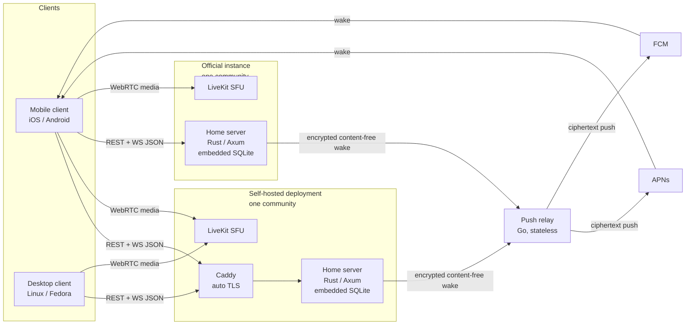

# slim-m Implementation Strategy

This is the single compiled pre-implementation strategy for slim-m, a lightweight, cross-platform, open source, Discord-style messaging platform with optional self-hosting.
It merges the founding [project brief](BRIEF.md) with the foundational [stack decision](research/stack-decision.md) and the specialist domain reports and their adversarial reviews under [research/](research/).
Where two domains disagreed, this document makes the call and records why, so a contributor who has never read the research can build from this file alone.
The brief is the contract, and its priorities win conflicts.

The working name "slim-m" is a placeholder; the final name is chosen before the 1.0 release closeout.

## Reference scope

This plan was derived independently, on first principles plus the brief and the [owner decisions](decisions/0001-owner-decisions.md).
Only one region draws on the echo-messenger project: the Voice Canvas, whose interaction lessons and prior mistakes legitimately inform its fresh design.
Every other decision here (server language, framework, database, identity and ordering, wire protocol, client architecture, repository layout, CI, and packaging) was reasoned from the brief alone, with no reference to any prior codebase, module layout, library set, or toolchain.
"The owner already runs this toolchain" and "a previous project already did this" were not used as reasons for anything.
The push relay draws only on check-in-relay, a separate and allowed reference; nothing else in this plan depends on it.

## Executive Summary

slim-m recreates the core Discord experience (group chats and direct messages with text, voice, and screen sharing) around three non-negotiable priorities from the brief: performance as a first-class feature, extreme self-hosting simplicity, and an infinite collaborative Voice Canvas during calls as the signature feature.
The client is a Flutter application targeting iOS and Linux (Fedora, KDE Plasma Wayland) first and Android next, with iOS and Linux as the primary early test targets.
Cross-platform support is the goal for release; KDE Wayland is the development and test environment, not a narrowing of scope.
The server is a single Rust process on Axum that serves both the HTTP surface and the WebSocket event stream, with SQLite in WAL mode embedded directly in that same process, so a self-hosted deployment is one binary and one data directory with no second database service to operate.
A separate Go push relay, adapted from check-in-relay, exists only to wake mobile devices, never to route messages.
Real-time voice, video, and screen share run through a self-hostable LiveKit SFU, kept strictly separate from the chat and canvas data planes.

Two structural properties drove the largest decisions.
First, a self-hosted server for a handful of users spends nearly all of its life idle, so the dominant cost is the runtime itself, which is why the server is a no-GC Rust binary with an embedded database rather than a garbage-collected runtime fronting a separate database process.
Second, the architecture has exactly one writer of record per ordered stream, which removes the distributed-coordination problems a Discord-scale design assumes and lets identity, ordering, and sync all take their simplest correct form.
The third anchor is honest security scoping: v1 is transport-encrypted (TLS 1.3) with the server holding plaintext, not end-to-end encrypted, because full E2EE is incompatible with the brief's stated needs (history, search, sync, server-side moderation) and with "lightweight," while per-device identity keys are pre-wired so opt-in E2EE DMs can be added later without a wire-format rewrite.

Event identity and total order are two jobs handled by two fields: a client-generatable UUIDv7 is the stable identity that powers optimistic local echo and retry idempotency, and a server-assigned, per-scope, strictly monotonic 64-bit sequence number is the authoritative order and the sync cursor.
Snowflake-style bit-packed IDs are rejected because their entire value is coordinating multiple uncoordinated writers, a problem this single-writer design does not have.
The wire protocol is schema-first JSON: `schema/openapi.yaml` is the single source of record (there is no separate JSON Schema file; the WebSocket envelope lives inside the same OpenAPI document), and version-skew rules are additive-only, so a fleet of independently upgraded self-hosted servers stays compatible with one official client while every frame stays readable on the wire.
Corrected 2026-07-30: this sentence used to also say the schema "generates both the Dart and Rust types, CI fails on any drift."
No types are generated from it.
The Rust DTOs and the Dart models are both hand-written; CI gates the route surface (a route cannot be added, removed or renamed without a matching schema edit) and, Rust-side only, response bodies against what the schema documents, plus additive-only evolution and valid OpenAPI.
Request bodies and the Dart models are not checked against the schema on either side; `schema/openapi.yaml`'s own header has said this precisely since the phase 3 audit, and this paragraph had not been brought in line with it.

This strategy resolves every critical and major finding raised by the adversarial reviews.
The most consequential resolutions: the per-stream sequence counter is keyed by stream so a channel's messages and its canvas ops are two independent ordered scopes rather than colliding on one counter; backpressure is traffic-class aware so a busy multi-user drawing session cannot close a slow client mid-stroke; the push-worthiness check is gated on a client-reported foreground/background signal so a suspended iOS app is never silently left un-notified; account deletion tombstones content rather than merely deactivating (the schema that shipped has no ownership model to transfer, corrected below); the production docker-compose runs LiveKit with a resolved port strategy so voice actually works as documented; and the invite-based account model gains a mandatory in-app account-deletion verb, report, block, moderation tooling, and an 18+ rating to pass App Store and Play review.

## Product Scope

### v1 includes

- Group chats and direct messages with text messaging, reactions, and message history.
- Voice calls and screen sharing in both group channels and direct messages, over a self-hostable LiveKit SFU.
- The Infinite Voice Canvas during calls: freeform drawing, pasted images and GIFs, movable and resizable windows, floating camera bubbles, and floating screen shares, all arranged in one shared world-coordinate space.
- An official hosted instance and fully self-hosted servers, both running the same server image.
- Invite-link and invite-code account creation on self-hosted servers with no email verification, plus standard account creation on the official instance.
- An official Go push relay for mobile push notifications and background wake-ups, carrying only encrypted, content-free payloads.
- Multi-device per user, treated as an explicit day-one requirement.
- Administration tooling: user management, invite management, roles and permissions, diagnostics, logging, moderation queue, health monitoring, and performance metrics tracked over time.
- In-app report, block, and account deletion, always visible client-side.
- Procedurally synthesized notification sounds committed alongside their generator scripts.
- Docker-first deployment: an official GHCR multi-arch image, a production Dockerfile, and a production docker-compose example.
- Linux artifacts (Flatpak primary, rpm alongside) and an iOS TestFlight pipeline.

### v1 explicitly excludes

- End-to-end encryption of messages, canvas content, or group media; v1 is transport-encrypted only, with per-user and per-device identity keys pre-wired so opt-in E2EE DMs can be added later without a wire-format rewrite.
- Flutter web and macOS/Windows desktop as supported targets; the wire format and permission bitset are nonetheless designed to remain safe if web is ever added.
- Multiple independent communities hosted under one backend deployment; one deployment is one community in v1, and the official instance is itself a single community, not a multi-community host.
- Federation between deployments in the Matrix or ActivityPub sense; clients connect directly to a chosen server, and direct messages work only between users on the same deployment in v1.
- H.264, AV1, and VP9 SVC video codecs; v1 ships Opus audio and VP8 simulcast only.
- Client-side video effects and background blur.
- A relay-side devices database, message proxying, fan-out, dedup, or badge counting; the relay stays a stateless forwarder.
- Multi-process horizontal scaling of a single deployment as a shipped default; state sits behind a swappable interface so a shared backplane can be added only when scale actually demands it, and v1 ships single-process.
- Read receipts visible to other users (own-device read-state sync is included); deferred by owner decision as a later opt-in.
- A foundation, steering committee, or CLA; governance is single-maintainer with a documented path to add maintainers, and provenance is DCO sign-off.

## Architecture Overview

The client talks to exactly one deployment at a time over REST (request/response) and a single JSON-over-WebSocket gateway (real-time events).
Durable actions (send message, edit, react, commit a canvas object) are REST calls carrying the client's UUIDv7 as an idempotency key, so a retry after a dropped acknowledgment returns the original result rather than a duplicate.
The WebSocket carries server-to-client fan-out plus low-value client-to-server ephemeral signals (typing, presence heartbeat, in-flight canvas preview frames), and never a durable write, which keeps durable correctness off the backpressure-managed socket path.
Voice, video, and screen share never touch that gateway; they run as WebRTC media directly between the client and that deployment's LiveKit SFU.
When a mobile client is backgrounded or offline, the server sends a content-free, encrypted wake event to the official relay, which forwards it via APNs or FCM; the woken client then connects directly back to its server and runs the ordinary catch-up sync to fetch content.
The official instance is not special: it runs the same server and LiveKit images, embeds its own SQLite database, and registers through the same relay as any self-hoster.



Three data planes stay strictly separated: the chat and canvas control plane (REST plus WebSocket JSON), the media plane (WebRTC through LiveKit), and the wake plane (relay push).
Canvas objects reference a LiveKit participant or track identity as an opaque pointer only; media never flows through the canvas or WebSocket channel, and content never flows through the relay.

## Key Decisions

### Flutter Client

Decision: a single Dart pub workspace (native to Dart 3.6, no third-party monorepo manager) of small path-dependency packages: `api`, `design_system`, `data`, `platform`, `rtc`, `app`, with a `voice_canvas` package boundary reserved for its own track.
State management is Riverpod with code generation (Notifier and AsyncNotifier), which is also the dependency-injection mechanism, so there is no second DI container.
Navigation is GoRouter with shell routes for the persistent sidebar, using hand-written typed route constants rather than a third code generator.
Local storage is Drift (SQLite) as the single source of truth for conversations, messages, channels, reactions, and canvas cache, keyed by UUIDv7 with an indexed sequence column used for ordering and as the resume cursor; keys use flutter_secure_storage (Keychain on iOS, libsecret on Linux).
See [research/flutter-client.md](research/flutter-client.md).

Rationale: a real package gives a compiler-enforced public API that a folder convention cannot, and pub workspaces deliver that without adding a third build tool alongside the two code generators the wire format and Riverpod already require.
Riverpod's provider graph is itself the DI graph, so a second runtime-typed container would duplicate a compiler-checked one.
Drift mirrors the server's own compile-time-checked-query discipline end to end and gives indexed, paginated, reactive local queries rather than in-memory filtering as history grows.

Hot-path rule: Drift persists and hydrates only.
The 60fps canvas paint layer is fed by an in-memory spatial index plus a plain off-Riverpod ChangeNotifier, never a Riverpod StreamProvider watching a Drift query.
The same off-Riverpod, RepaintBoundary-isolated pattern governs every high-frequency surface: drag data, typing previews, presence, and avatar or cursor moves.
Every write path into Drift (WebSocket push and REST catch-up) is an idempotent upsert by UUIDv7, so a reconnect race cannot duplicate or reorder rows, and events are applied strictly by (scope, sequence), never by arrival order.

Ownership and structure: a named `rtc` package owns the LiveKit Room and client wrapper behind an explicit public API with a Room-injection seam so voice can be tested without a live SFU.
The `platform` package owns per-OS integration behind abstract interfaces; the iOS side includes a minimal native Swift PushKit and CallKit delegate because cold-launch VoIP reporting must run before the Flutter engine is alive.
Settings and account, moderation (report and block), and admin screens are first-class screens with owning packages and test coverage, not afterthoughts.
Lucide icons are wrapped behind an internal `AppIcons` class so an icon-set change never ripples through feature code, and a CI check greps `lib/` for emoji literals to enforce the no-emoji-as-chrome rule mechanically.
Errors cross layer boundaries as a sealed `Result<T, AppError>` decoded directly from the server's schema-defined error responses, not as exceptions.

Rejected alternatives: a monorepo manager such as Melos (a third build tool for boundaries the native pub workspace already gives); a single flat `lib/` tree (no compiler-enforced boundaries); Bloc and GetX for state (event boilerplate, and a global service-locator with weak testability); get_it or injectable (a second competing graph resolved by runtime type); Isar, ObjectBox, or raw sqflite for storage (maintenance-continuity concerns, native-binary weight, or no type safety and no reactivity).

Accepted risks: multi-package builds and two stacked code generators (Riverpod plus Drift) add setup overhead and occasionally opaque generated errors, mitigated by a small stable package count, path-only dependencies, and running both generators in one CI pass.
The device identity key is stored via flutter_secure_storage, which is Keychain- or libsecret-backed, not Secure Enclave non-extractable key generation; v1 accepts this, and the key-storage interface is shaped now so a future move to hardware-backed non-extractable keys does not require an interface change when opt-in E2EE lands.
Impeller maturity differs by platform (more proven on iOS than Linux) and its enabled state is verified per platform in CI.
The two independent permessage-deflate implementations on the Dart and Rust ends get an explicit early interop test rather than an assumption that RFC 7692 compliance on both sides is sufficient.

### Server Language and Framework

Decision: Rust on the stable toolchain, async on Tokio, with Axum (on Tokio, Hyper, and Tower) serving both the HTTP surface and the WebSocket event stream in one process.
See [research/stack-decision.md](research/stack-decision.md).

Rationale: a self-hosted server for a handful of users idles almost all its life holding a few long-lived WebSocket connections, so the dominant steady-state cost is the runtime itself.
Rust has no garbage collector, so there is no reserved GC heap above live data and no scavenger thread waking the process on a timer under zero load, which is a structural win on the two hardest axes the brief names (idle RAM and idle CPU) rather than a tuned one.
The server is also a long-lived stateful realtime hub where many concurrent connections mutate shared state, exactly the class of bug that surfaces as an intermittent data race under timing-dependent load and that tests catch poorly; Rust's ownership model and its Send and Sync traits turn most of these into compile errors on a box nobody is actively watching.
Axum is maintained by the same working group as Tokio, so the framework tracks the runtime it depends on; its extractor model turns "is this request authenticated and well-typed" into a compile-time-checked signature; WebSocket upgrade is a first-class extractor so the connection hub sits next to the routing layer; and its Tower middleware is opt-in, so a lean self-host build compiles in only the layers it uses.
The internal module structure is a Rust workspace of crates with deliberately narrow `pub` surfaces (transport, protocol, domain and permissions, persistence behind a repository trait, push, moderation, admin, and observability), so componentization is compiler-checked rather than a style-guide sentence, and this layout was derived from the brief's componentization goal, not from any prior project's folders.

Rejected alternatives: Go (its garbage collector taxes exactly the idle RAM and idle CPU axes the brief prizes, and its contributor-pool advantage lives on the development-cost axis the owner's engineering standard says not to weight heavily, so it becomes the named fallback if contributor onboarding ever proves the actual binding constraint); Elixir on the BEAM (runtime-supervision safety rather than compile-time-proven, higher baseline footprint, no compile-time query verification); Node, JVM, or CPython (lose on cold start, steady-state CPU predictability, and baseline heap before a connection is served); Zig or C (smallest binaries but no mature battle-tested async HTTP, WebSocket, TLS, and SQLite stack, a correctness and security risk not worth a marginal size win); Actix-web (unneeded actor-model surface and a since-remediated unsafe-code history that still warrants more scrutiny than the boring Tokio and Tower stack); hand-rolling routing on Hyper (a permanent maintenance burden for a small size saving).

Accepted risks: Rust's learning curve and compile times are a real ongoing cost against "easy to contribute to," and async Rust has sharp edges around trait bounds, pinning, and cancellation safety inside select branches.
Mitigate by keeping the async surface small and conventional, pushing most logic into plain synchronous, easily-testable functions with only a thin async connection-handling layer, documenting the concurrency patterns the codebase actually uses, and standing up clippy plus mandatory review as a permanent practice.
Axum's WebSocket support is intentionally low-level, so connection-lifecycle management (bounded outbound queues, ping and pong keepalive, idle reaping, graceful shutdown) is treated as a first-class, well-tested module rather than inline handler code, since an unbounded per-connection queue feeding a slow client would become a slow leak rather than a loud crash.

### Data Storage and Access

Decision: SQLite in WAL mode, embedded in the server process, accessed through sqlx with compile-time-checked queries.
Writes are funneled through a single serialized writer path; reads use a small read-only connection pool that WAL mode serves concurrently with the writer.
Migrations are forward-only, ordered SQL files run by sqlx's embedded migrator at startup, with no down-migration rollback path.
All persistence sits behind a repository trait so the storage backend is a swappable implementation detail, with Postgres as the documented later target for a single community that genuinely outgrows one process.
This one tier serves both the official instance and every self-host, since one deployment is one community, so the official service is a single-community process with its own SQLite file, not a shared multi-tenant database.
See [research/database.md](research/database.md) and [research/stack-decision.md](research/stack-decision.md).

Rationale: for a handful of users the largest single lever on idle footprint is whether there is a second process at all, and an embedded engine removes an entire second process, its idle RAM floor, its own container, and its own backup and upgrade story.
SQLite's single-writer model is not a new constraint the database imposes on the app; it is the same constraint the app's own write path already chose, so the two line up instead of fighting.
sqlx's query macros validate the literal SQL against the real schema at build time, so a refactor that breaks a query fails cargo build instead of a running self-hosted server, extending the same compile-time-correctness property that justified Rust into the persistence layer.
High-frequency, low-durability events (typing, presence, in-session canvas preview frames) stay off the durable SQL write path entirely, so the single writer never becomes a hot-path bottleneck.

Schema commitments the reviews forced:

- Event ordering uses a `channel_seq_counters` table keyed by `(channel_id, stream)`, where a channel's messages and its canvas ops are two independent streams with two independent sequence spaces incremented in the same transaction as the insert, so one counter row can never be asked to back two scopes at once.
- Full role-based access control: a 63-bit permission bitmask in one INTEGER on `roles`, plus one polymorphic `channel_overwrites` table keyed on `(channel_id, subject_type, subject_id)` covering both per-channel-per-role and per-channel-per-member overrides, so allow and deny resolution lives in one place.
- Effective permissions compute through one pure evaluator: the @everyone base, then the union of the member's role bits, then channel role-level overwrites with deny winning within that tier, then the member-level overwrite applied last and absolute, with ADMINISTRATOR bypassing, so a higher-positioned role can never let an allow override another role's deny.
- A `password_reset_codes` table (code_hash, issued_by, expires_at, used_at) backs owner decision 6's admin-issued one-time reset code, which otherwise had rationale but no table.
- `attachments` are content-addressed by sha256 as primary key for instance-wide dedup, encrypted at rest under a server-held key (not a convergent per-content key), with a `key_version` column for rotation; blobs live on disk outside the database file, and the server key is stored and backed up separately from both the database file and the attachment tarball.
- Account deletion tombstones the `users` row (scrub PII, set deleted_at, revoke all devices and refresh tokens) while keeping authored messages with the author shown as removed, since a message is also part of other participants' history. Corrected 2026-07-30: the schema that shipped has no per-channel or per-deployment owner column, so there is no ownership to transfer; `store/account_deletion.rs` says so directly. What actually guards against a stranded deployment is that the last administrator cannot delete their own account while other members remain (409), tested in `tests/account.rs::the_last_administrator_cannot_strand_a_populated_deployment`.
- `canvas_objects` carry explicit `x, y, w, h` columns backed by a SQLite R-Tree virtual table for viewport bounding-box queries, kept in sync by triggers exactly as FTS5 is, never declared WITHOUT ROWID, with an `is_encrypted`/opaque-payload column mirroring messages so the canvas is not silently a permanent unencrypted log with no forward path.
- Reactions are deliberately not independently sequenced (they are small commutative idempotent set operations on `(message_id, user_id, emoji)`); a message's current reaction aggregate is delivered and re-fetched with the message itself, so catch-up sync of a message carries its reactions with no separate cursor.
- A minimal `canvas_audit_log` (who created or removed which object, when) is retained independently of and longer than the fine-grained op log, exempt from op-log compaction, so moderation evidence survives compaction.

Full-text search is SQLite FTS5 in external-content mode over `messages.content`, kept in sync by insert, update, and delete triggers, indexing only rows where `is_encrypted = 0` and dropping a row from the index on a `deleted_at` transition, with the unicode61 tokenizer.
There is deliberately no email column anywhere in v1, matching the no-email invite model and the admin-issued reset-code recovery, neither of which needs an address.
History pagination is keyset on `(channel_id, seq)`, never offset, backed by a `(channel_id, seq DESC)` index partial on `deleted_at IS NULL` that also backs unread counts.

Rejected alternatives: Postgres as the default for every size (reintroduces exactly the second-process weight the self-host requirement forbids, for multi-writer concurrency this scale will not use); a dual-backend abstraction shipped on day one (operational weight a friend-group self-host should not pay); rusqlite with a hand-built writer thread (the footprint delta versus sqlx at this scale is negligible, and the deciding difference is the compile-time query guarantee); a full ORM such as Diesel or SeaORM (synchronous core forcing a spawn_blocking bridge, and a Postgres-default reintroducing the second process); key-value stores such as sled or redb (the data is genuinely relational and would require hand-rolled secondary indexing SQLite already provides); a separate search service such as Meilisearch or Elasticsearch (too heavy for the lightweight bar); convergent per-content attachment encryption (leaks presence of known content via hash confirmation and buys nothing in a small trusted-operator deployment).

Accepted risks: SQLite serializes writes even in WAL mode, so if a single community grows well past friend-group scale before a Postgres repository implementation exists, write latency becomes a real ceiling; mitigate by defining the repository trait from day one, keeping write transactions short with a sane busy_timeout, keeping ephemeral high-frequency events off the durable path, and treating write-latency and lock-contention metrics as the explicit trigger to build the second storage implementation as a planned swap.
FTS5 and R-Tree are optional compile-time SQLite features that must be explicitly enabled in the build, or search and canvas indexing silently degrade to table scans.
sqlx's compile-time checking is only as good as the committed offline query cache staying in sync with migrations, so cache regeneration and a `cargo sqlx prepare --check` diff run in CI.
`VACUUM INTO` holds a snapshot open during backup and defers WAL checkpointing, letting the WAL file grow during the backup itself, so backups run in low-activity windows with WAL-size monitoring.
Expanding the permission bitmask past 63 flags later is not a trivial migration but a coordinated Dart-and-Rust wire-format change across the self-hosted fleet, which is stated honestly so it is planned rather than rushed.

### Event Identity and Ordering

Decision: every event carries two identifiers with two distinct jobs, modeled as distinct types, not both as bare integers or strings.
A UUIDv7 is generated at creation time, client-side where applicable, as the stable globally unique identity: it lets the client optimistically render locally before the server acknowledges, and it doubles as an idempotency key on retry, enforced by a unique constraint on `(scope, client_event_id)`.
A strictly monotonic, per-scope, signed 64-bit sequence is assigned by the server at commit time and persisted in the same transaction as the event; this sequence, not the UUID, is the authoritative total order and the sync cursor.
A scope is one independently ordered stream: a text channel's messages, a direct-message conversation, or a channel's canvas ops, each with its own durable counter.
See [research/stack-decision.md](research/stack-decision.md) and [research/realtime-sync.md](research/realtime-sync.md).

Rationale: identity and order are two problems, and collapsing them into one field does both badly.
Identity must be constructible by the client before any round trip so optimistic echo and retry dedup work, which a server-only sequence cannot satisfy; UUIDv7's 48-bit millisecond timestamp prefix also sorts approximately by time, giving better SQLite B-tree locality than random UUIDv4 and reducing write amplification on small self-hosted disks.
Order must be a strict, gap-detectable total order within a scope, which a timestamp cannot give once two events land in the same millisecond and which a client-generated value cannot be without reintroducing the distributed-uniqueness problem the single-process design exists to avoid.
Because each deployment is single-community and single-process, there is exactly one writer of record per scope, so a plain durable monotonic counter incremented inside the insert transaction is both sufficient and the simplest correct answer, with no worker-id allocation and no clock-skew handling.

Rejected alternatives: a single Snowflake-style ID packing timestamp, worker-id, and counter (its entire value is letting uncoordinated nodes mint conflict-free IDs, a problem this architecture does not have, so it would mean either a permanently zero worker-id field every contributor must understand for no benefit or building distributed worker-id allocation prematurely, and it conflates identity and order); client-generated ULIDs as the order key (reintroduces multi-writer ordering ambiguity).

Accepted risks: the sequence must be persisted durably in the same transaction as its event, never merely held in memory and incremented, or a crash and restart can reuse or skip numbers clients cannot reconcile; "assign the next sequence for this scope" is its own repository-trait method so a future coordinator can be substituted at one seam.
Because identity is only approximately time-sortable, any query that orders history by identity instead of by sequence will silently misorder, so an automated check asserts every history and sync query orders explicitly by sequence.
A per-scope sequence has no meaning across scopes, so a future global activity feed spanning channels would need its own ordering answer, flagged if such a feature is ever proposed.

### Protocol and Sync

Decision: schema-first JSON over both HTTP and WebSocket for the v1 control plane.
One source of record, `schema/openapi.yaml`, documents both the REST resource surface and the WebSocket event envelope and payloads.
Corrected 2026-07-30: this used to say the schema "generates both the Dart client types and the Rust server types, and CI fails on any drift between the schema and the committed generated code."
Neither is generated; both are hand-written.
CI gates the route surface, additive-only evolution and valid OpenAPI on both sides, and response bodies against the schema on the Rust side only; request bodies and the Dart models are unchecked.
See `schema/openapi.yaml`'s own header and `client/packages/api/lib/src/models.dart`'s.
The WebSocket event stream uses a small typed envelope: a discriminated `type`, a protocol version, and the per-scope `seq`.
permessage-deflate is enabled on the socket, and a compact binary encoding is reserved as a documented, additive, per-message-type escape hatch for hot paths that measurement later proves need it, with the client's decode layer already dispatching on the envelope discriminant before assuming JSON.
See [research/realtime-sync.md](research/realtime-sync.md) and [research/stack-decision.md](research/stack-decision.md).

Rationale: at ordinary control-plane message sizes and rates, a binary encoding's advantage over JSON is modest, and permessage-deflate closes most of the gap because JSON's repetitive key structure compresses well; the one surface where binary density would truly pay is the high-frequency Voice Canvas op stream, which is handled separately.
Readable frames serve the brief's self-host and contributor goals directly, since an admin diagnosing a connection or a contributor pasting a raw frame into an issue can read it without a decoder, and JSON's zero-toolchain baseline on both Dart and Rust keeps the contributor prerequisite empty.
To capture the cross-language type safety and graceful version-skew a binary RPC would have offered, the JSON is generated from one schema of record, the protocol is versioned in the envelope, unknown fields are ignored, changes are additive-only with a documented deprecation path, and CI runs a schema-compatibility check against the previous release.

Transport of each operation is stated explicitly to remove an implicit assumption the reviews caught.
Durable client-to-server actions (send, edit, react, commit a canvas object) are REST calls whose UUIDv7 is the idempotency key, so they never contend with the WebSocket's bounded outbound channel and a retry is safe by construction.
The WebSocket carries server-to-client fan-out plus ephemeral client-to-server signals only.

Gateway lifecycle: the client mints a short-lived, single-use connection ticket over an authenticated REST call and opens the socket with that ticket, never its long-lived session credential, since reverse proxies commonly log full request URLs; the ticket has a roughly 30-second TTL and single-use redemption, and its minting endpoint has its own explicit rate-limit class so an authenticated session cannot loop-mint tickets.
Heartbeat is an application-level ping and pong around every 20 seconds, and two missed beats trigger reconnect with backoff and jitter.

Resume is fully stateless: the server keeps no per-connection resume state, and every reconnect (after two seconds or two weeks) is the same client-driven catch-up sync against durable per-scope cursors.
Catch-up is one bundled call per reconnect carrying the client's per-scope cursors for every scope it belongs to, answered per scope by an indexed range scan on sequence greater than the cursor, capped at roughly 500 events per scope and roughly 2,000 in aggregate with a continuation flag, and falling back to a snapshot pointer for a cursor so far behind that walking the gap is wasteful.
To keep a correlated reconnect storm (a shared-network blip reconnecting many clients at once) from becoming a synchronized read burst against the single SQLite reader, reconnect backoff is jittered and the bundled catch-up is one grouped query per user rather than one per scope.

Backpressure is traffic-class aware, which resolves the interaction the reviews flagged between the socket's bounded channel and Voice Canvas fan-out.
Each connection has a bounded outbound channel sized in bytes (measured on pre-compression logical payload, not post-deflate), for example 1 MB; on overflow of durable events the server closes the connection with a distinct close code and lets stateless resync recover it, which is a safe control valve because resync is always correct.
Ephemeral frames (typing, presence, canvas preview, cursor moves) are never allowed to trigger that hard close: they ride a separate ephemeral path and are coalesced latest-per-actor before any buffer pressure, so a multi-participant drawing session cannot disconnect a slow receiver mid-stroke.

Read state is one row per `(user, scope)` storing a last-read sequence, updated only through a monotonic guard, with unread counts computed on demand from an indexed range count rather than a separately incremented counter that would multiply writes against the single writer and drift after a bug.
Read-state updates fan out only to the same user's other live connections, never to other users, matching the deferral of visible read receipts.

Typing and presence stay fully ephemeral, never sequenced, never persisted, and excluded from catch-up sync.
Typing has no explicit stop event; the client clears its own indicator after a roughly 8-to-10-second silence window, since a lost stop frame would otherwise strand the indicator.
Presence is derived from whether the process holds a live connection, broadcast only to users sharing a scope with the subject so cost scales with the social graph, with a short grace period before an offline announcement so a quick backgrounded reconnect does not flicker.

Push triggering is fused into the same commit-and-fan-out step: after an event's sequence is assigned and persisted, any recipient device with a live connection is served over the socket and generates no push, and devices with no live connection are queued after a short debounce so a burst collapses into one wake.
Because iOS can suspend a backgrounded app while its socket still looks live inside the heartbeat window, the live-connection check is gated on a client-reported foreground/background lifecycle signal rather than raw socket liveness, so a suspended app is treated as push-eligible instead of being silently skipped.
A woken client runs the identical stateless catch-up sync, so push is only a wake trigger and introduces no separate delivery path.

Rate limiting is in-process token buckets keyed by user and limit class, behind a trait so a shared-store implementation can be swapped at one seam if the official instance ever needs multiple processes, with only in-process shipping in v1.
Every keyed limiter has an idle-bucket sweep (an eviction pass on the check-in-relay pattern) so per-IP and per-user buckets do not grow unbounded over a long-running process.
The per-user-per-scope message limit uses per-device sub-buckets under a shared ceiling, so one device's burst does not throttle the same user's unrelated idle device.

Rejected alternatives: an in-memory resume-token session table (adds expiry races and a window a restart silently invalidates, for a benefit limited to sub-few-second reconnects the stateless path already replays for near-free); one REST call per conversation on reconnect (N round trips, each a radio wake on mobile); a separately incremented unread counter; an explicit typing-stop protocol message; Protobuf or MessagePack as the default control-plane encoding (codegen and debuggability cost for a surface where permessage-deflate already captures most of the byte saving); unbounded per-connection queues or blocking sends in the fan-out loop.

Accepted risks: JSON decode CPU could matter at very large public-instance scale, profiled and revisited rather than pre-optimized.
Presence visibility is broadcast to shared-scope co-members by default, but v1 includes a hide-online-status option so a user can appear offline or invisible (owner decision), matching the privacy stance behind deferring read receipts to other users.
Direct messages work only between users on the same deployment in v1, because the per-scope single-writer model presumes both participants' accounts live in one deployment; this is documented as a deliberate v1 scope decision, and cross-deployment DMs or federation are a distinct future design, not an extension of this one.

### Media Stack

Decision: self-host LiveKit (Apache 2.0, Go server, official Docker image) as the SFU for voice, video, and screen share, with the official Flutter SDK across iOS, Linux, and later Android.
Launch codecs are Opus audio and VP8 simulcast video only; H.264 hardware encode and AV1/VP9 SVC are deferred until device telemetry justifies them.
See [research/media.md](research/media.md).

Rationale: owning a media engine (congestion control, simulcast, bandwidth estimation, ICE and TURN fallback) would mean maintaining WebRTC infrastructure instead of a messaging app, and LiveKit ships an official Flutter SDK, a single self-hostable container, and built-in TURN, which no hand-rolled or library-only option matches.
Run LiveKit as a single node with no Redis for the default self-host profile, so the media plane adds one binary alongside the one Rust binary with embedded SQLite, with no extra database to operate.
VP8 simulcast is the most universally supported simulcast codec across iOS, Android, and Linux libwebrtc, which matters because Linux is a primary platform, and simulcast already solves adaptive per-subscriber quality without AV1 or VP9 SVC's inconsistent hardware decode.

Deployment: a single-node LiveKit container in the production compose stack alongside the server and Caddy.
LiveKit's TURN and media path needs an explicit UDP port range (or host networking), distinct from the plain TCP proxying Caddy does for the app server, and misconfigured SFU networking is the most common self-host failure for any WebRTC service behind Docker, so the example documents it concretely.
The port-443 contention (LiveKit can mux TURN over TLS on 443, and Caddy also wants 443 for the API) is resolved explicitly: Caddy owns 443 for the REST and WebSocket API, LiveKit's TURN and TLS runs on its own documented port with its UDP media range and firewall notes, and SNI passthrough or a second IP is documented as an advanced option; the compose file never claims a 443-only deployment.

Coordinate and object rules: camera bubbles and screen-share tiles store position, size, and z-order in absolute world-space double-precision coordinates, the same space as strokes, never viewport-relative or device pixels, which structurally avoids the class of screen-share snapping bug that arises when one entity type uses device-local pixels.
The media and canvas planes stay separate: a canvas object references a LiveKit participant or track identity as a pointer only, and video pixels never touch the canvas data model.
Subscription binding ties LiveKit adaptiveStream and dynacast to canvas zoom and fully unsubscribes tracks outside the viewport, with a hysteresis margin and debounce so panning near the boundary does not flicker or thrash keyframes.

Security and lifecycle: LiveKit room access uses short-TTL capability tokens minted server-side per join, scoped to a server-derived room id (never client-supplied) and to the joining member's permission flags (publisher for members, subscribe-only for listeners), with participant identities nonced on rejoin to avoid SFU identity collisions.
This LiveKit token is a distinct capability system from slim-m's own opaque session tokens, reconciled in the security section.
A kick or ban calls LiveKit's room-service API to forcibly evict the participant immediately, not merely block future token minting, and a pre-expiry token re-mint and handoff keeps a mid-call signaling reconnect from silently dropping a participant.
VoIP tokens live in the server's `devices` table, not the relay.

Capture caps: camera at roughly 640x480 to 960x540 with Opus DTX so idle microphones stop consuming encode CPU; screen share gets its own explicit resolution and bitrate ceiling rather than being costed as just another camera stream; the decode-side cost of several concurrent VP8 streams on iOS (which has no hardware VP8 decode) is measured against the canvas render budget before VP8-only is treated as low risk.

Rejected alternatives: a custom Pion or ion-sfu SFU (own a media engine, no Flutter SDK, slowing upstream); mediasoup (a library not a server, needing a second Node runtime for room management and signaling); Janus (a more DIY room and admin surface with only community Flutter support); Jitsi (three coordinated services plus XMPP, too many moving parts for a handful-of-users target); raw peer-to-peer mesh (degrades past a few participants).

Accepted risks: group call media is decrypted at the SFU and is therefore visible to the server operator by design, stated plainly since group calls are a primary use case, with SFrame E2EE a later option.
iOS ReplayKit's roughly 50MB broadcast-extension memory ceiling and Linux flutter_webrtc PipeWire and Wayland maturity are real risks, de-risked by an early Fedora validation spike before deep canvas investment.
An aggregate egress bandwidth budget for a handful-of-users video room is load-tested alongside CPU and RAM.

### Voice Canvas Sync and Rendering

Decision: a per-object row model (`canvas_objects`: id, channel_id, kind, x, y, w, h, z_index, transform, props, created_by, sequence, timestamps) materialized from an append-only, per-scope-sequenced `canvas_ops` log.
The canvas exists only during a live voice call, so the sync model is server-authoritative last-write-wins by sequence order, not a CRDT.
This region draws on the echo-messenger Voice Canvas reference, deliberately reusing what worked and not repeating its flat-JSON-array data model or its ordering-free sync layer.
See [research/voice-canvas.md](research/voice-canvas.md).

Ordering: canvas ops are their own per-channel scope with their own sequence stream, assigned in the same transaction that writes `canvas_objects`, distinct from and not sharing a numeric space with the channel's message sequence.
Clients apply strictly by (scope, sequence), never by WebSocket arrival order, which eliminates clear-resurrection, image-move races, and late-joiner double-apply, since a `clear` op gets a sequence like any other and anything with a lower sequence is in its scope while anything higher is not.

Presence versus content: strokes, images, GIFs, and windows are persisted, versioned, and undoable; camera bubbles and screen-share tiles are ephemeral presence objects never written to the op log and reset on rejoin.
All object types share one world-coordinate space and one render list, merged in memory at paint time, so a sticky note can sit above a camera bubble; the z-order merge rule is defined explicitly so persisted `z_index` and the in-memory presence z-counter cannot diverge, with presence z reset on reconnect and content z replayed from the log.
Movable and resizable windows are not a fifth object kind but the shared drag, resize, and bring-to-front contract applied to images, GIFs, camera bubbles, and screen-share tiles; strokes are drawn, not repositioned, in v1.

Object streaming: the server answers viewport queries via the R-Tree bounding-box index, and a viewport-delta subscription streams objects for the visible region and its updates so a large world is fully reachable rather than only the join viewport; late-join fetches a materialized snapshot of the visible region, and panning triggers incremental region fetches.
Canvas reconnect discards local canvas state and re-fetches a fresh materialized snapshot rather than replaying raw ops across a clear or delete.
In-flight drag frames are ephemeral relay-only frames with a commit flag, so only the pointer-up frame is a durable REST commit that persists.

Rendering: an explicit pointer-count gesture state machine (idle, drawing, panning, pinching) drives a single root Listener, and rendering splits into layers under narrow RepaintBoundary triggers: a background grid, committed strokes, the in-flight local stroke, images and windows, and a presence video-texture layer so LiveKit's 30-to-60fps video updates never trigger stroke or image repaints.
Client-side render culling uses an in-memory uniform-grid spatial index (2048px cells) queried each frame against the expanded viewport, chosen over a client R-tree for simplicity, while the server's R-Tree serves database viewport queries; the two indexes serve different layers and do not conflict.
A recenter-on-drift technique rebases the render matrix to a local origin when the camera drifts far from the world origin, avoiding float-precision artifacts, and "infinite" is implemented as a very large bounded double-precision world (roughly plus or minus 5,000,000 logical pixels, owner decision) with client-side recentering, with the literal-infinity wording kept out of in-app copy.

Undo, caps, and authorization: undo emits a new inverse op with its own sequence rather than rewriting history, and is restricted to the object's author or a member with a moderate permission, since any-member undo would let anyone revert others' work.
Object growth uses a surfaced soft cap (targeting smooth performance to roughly 5,000 objects on iOS and 20,000 on Linux) plus a high hard ceiling with a clear error, never a silent drop.
Image and GIF memory uses a bounded LRU decoded-bitmap cache (96MB iOS, 256MB Linux) with a mip-tier swap and a hard cap of 8 concurrently animating GIFs.
Canvas rate limits are split: a strict per-user persisted-op cap and a separate, much higher byte-rate cap for ephemeral relay-only preview frames, so an actively dragging user is not disconnected mid-stroke.
Collapsing the canvas to a thin strip for voice-only participants unmounts and suspends the spatial-index and paint layers rather than merely resizing them, and voice-only has a separate lower CPU and battery budget.

Accessibility: the canvas cannot be made fully screen-reader equivalent to a spatial drawing surface; the disclosed fallback is a text-based canvas activity log of who drew or pasted what and when, reachable without opening the canvas.

Rejected alternatives: a flat-array model with a bigger cap (only delays the migration to a real per-object table); a CRDT (solves offline multi-writer merge the canvas never needs, since it only exists during a live call already requiring a live socket, and relocates the clear-resurrection bug into the merge algorithm); per-object server-side locks (disproportionate for a rare collision during a live call, so concurrent edits are last-write-wins with an advisory-only move hint); arbitrary-precision coordinates for true infinity (unjustified for a chat whiteboard).

Accepted risks: op-log growth is bounded by a compaction and archive job at roughly 30 days, with the lighter `canvas_audit_log` kept longer and rows tied to open moderation reports exempt so evidence is not lost; the day-one tuning (mip-tier cache, GIF caps, object-count targets) is validated by the de-risking spike and adjusted to real telemetry rather than shipped blind.

### Security and Account Model

Decision: TLS 1.3 plus DTLS-SRTP is the mandatory v1 baseline; end-to-end encryption is deferred, with per-user X25519 and Ed25519 keys and per-device keys pre-wired so opt-in E2EE DMs and multi-device key cross-signing are addable later without a wire-format rewrite.
See [research/security.md](research/security.md).
Full Signal-style E2EE is rejected for v1 because it breaks history, search, sync, and server-side moderation, and is not lightweight; the self-hosting trust model already places the operator inside the content boundary.

Sessions and auth: opaque server-side session tokens (short access, rotating refresh bound to device with reuse detection that revokes the whole family on a replay, stored only as SHA-256 hashes), backed by revocable device-session records, so an admin ban or device revocation takes effect instantly with one indexed query.
Passwords use Argon2id at 19 MiB, but concurrent Argon2id evaluations are bounded by a semaphore sized to the memory budget so a burst of unauthenticated logins cannot exhaust memory under the server's light-activity ceiling.

LiveKit reconciliation: LiveKit genuinely requires a JWT for room access, so the opaque-token stance applies to slim-m's own user auth only; LiveKit room tokens are a separate, short-TTL capability system whose grants (connect, publish audio, publish video, screen share) are derived from the permission bitfield, with room-id derivation, per-role scoping, and rejoin nonces documented.

Transport trust, scoped honestly: v1 uses standard CA TLS 1.3 via Caddy auto-TLS.
A long-lived Ed25519 server identity key, persisted in a volume and pinned by the client via the invite fingerprint, provides server-identity continuity (trust-on-first-use, detecting a server changing identity), and is explicitly not claimed as an active-MITM defense, because with TLS terminated at Caddy the client's signature cannot be channel-bound.
Identity-key rotation is a signed mechanism (a new key countersigned by the old), and the client UX distinguishes legitimate recovery from an attack rather than training users to click through mismatches.

Permissions: the role-based bitfield is resolved by the one pure deny-by-default evaluator described under Data Storage (@everyone, union of roles, channel role overwrites with deny winning, member overwrite absolute, ADMINISTRATOR bypass), authorizing every action server-side including each Voice Canvas mutation, since trusting client-broadcast mutations is a classic real-time-collaboration vulnerability.
The wire format carries the flag set as a string or byte-array bitset, not a raw double-limited integer, so a future flag past bit 52 is safe if Flutter web is ever targeted.
Optimistic canvas mutations have a defined reject-and-rollback contract keyed by op id, separating one-time session capability checks from per-op shape validation.

At-rest scope, stated honestly: v1 encrypts attachment blobs at rest under a server key (with a key_version for rotation, stored and backed up separately from the database file and tarball) and documents operator-managed volume or disk encryption as the defense against raw backup theft.
Message text remains plaintext in SQLite and the blob key path is operator-controlled, so v1 does not claim confidentiality against an attacker holding both the database file and the host; real external key separation is future work.

Multi-device: per-device keypairs exist from day one for push encryption and future E2EE, with a user-level identity that will cross-sign device keys when E2EE lands; multi-device is an explicit day-one requirement, not a retrofit.

Abuse controls: layered token-bucket limits, in-process by default with idle-bucket sweeping and injectable to a shared store for the official instance, covering per-IP and per-account login throttling, invite throttling, ticket-mint throttling, per-user message and canvas caps (per-device sub-buckets under a shared ceiling), and a per-device relay wake cap plus a tighter call-push cap.
The official instance additionally centralizes lockout and adds an IP-independent step-up (proof-of-work on repeated failures) rather than relying on per-IP throttling alone against IP-rotating credential stuffing.
Attachment safety validates by magic bytes, caps size and pixels, strips EXIF, serves from random keys with attachment disposition and nosniff for any web surface, and disables server-side link unfurling by default; the native client additionally applies dimension and memory decode budgets before decoding attacker-supplied images.

Account model and App Store adjustments (detailed below): invite links carry a 128-bit token plus server address and identity fingerprint; short human codes are strictly throttled; the app adds mandatory in-app report, block, and account deletion, a terms-of-use gate at invite redemption, and an 18+ rating.
Account recovery on self-hosted servers is an admin-issued one-time reset code only in v1 (owner decision), backed by the `password_reset_codes` table; there is no recovery email in v1, which fits the no-email invite model, with recovery email addable later if demand appears.

Rejected alternatives: stateless JWTs for user auth (un-revocable, alg-confusion footguns); TLS certificate pinning (breaks on rotation); self-signed certs on mobile (hostile under App Transport Security); CAPTCHA as the primary abuse defense (heavy and privacy-hostile).

Accepted risks: a malicious operator or a breach of both the database file and host exposes stored messages, mitigated by attachment-blob encryption and documented volume encryption; traffic-analysis timing remains visible to the relay operator, with batching and jitter deferred; on the official instance one operator runs both server and relay, so the relay-versus-server metadata boundary is real only for self-hosted deployments, stated plainly.

### Push Relay

Decision: adapt check-in-relay's per-server scoped-key model; one key authorizes both FCM and APNs via a per-message platform field, and the official instance routes through the same relay path as any self-hoster so the server codebase has exactly one send path.
See [research/networking-relay.md](research/networking-relay.md).
The relay stays a stateless forwarder: it holds no devices table, and servers pass opaque tokens on every send, rejecting the brief's literal ask for relay-side per-user device persistence because it would duplicate the server's own registry and widen metadata exposure.

Provider path: add a direct APNs HTTP/2 path using Apple's token-based .p8 auth key alongside the FCM path, with a separate APNs voip topic for calls and a unified result mapping (FCM UNREGISTERED versus APNs 410 or BadDeviceToken) so callers prune consistently.

Payload privacy: the payload is always encrypted to the device's push key and carries only a coarse kind (message, mention, call, wake); no plaintext title or body ever reaches the relay, APNs, or FCM.
The server encrypts the notification to a domain-separated per-device push subkey using a sealed-box or HPKE construction (not the raw identity key); the iOS Notification Service Extension decrypts on-device with a generic fallback alert, and Android uses data-only FCM messages so the app builds the notification itself.

Token-harassment fix: each device push token is bound to the key that first registered it, and cross-key sends for that token are rejected, closing the standing-harassment vector without a relay devices table.

Reachability: WAN reachability is a documented hard precondition for push; a server behind NAT with no port forward uses the server's PushSender disable path instead of registering for an unfulfillable wake, and onboarding surfaces a reachability check.

Call routing: the call kind uses PushKit VoIP plus CallKit and applies only to 1:1 calls and explicit call invites, never to joining an already-active persistent voice channel, which would otherwise ring every member's phone.
Every VoIP push must synchronously report to CallKit as a mandatory invariant with explicit regression-test coverage, and the VoIP push reports a generic incoming call first, reconciling caller identity after connecting, since VoIP pushes bypass the NSE decrypt model.
A per-server call-push mute and reputation limit defend against a hostile fork harassment-bombing a victim's CallKit, distinct from the per-device volume cap.

Throughput: the serial send loop is replaced with a bounded worker pool with a hard per-request deadline returning partial results (or accept-and-poll for large batches) so a large token batch cannot become a multi-minute synchronous HTTP response, and every keyed limiter has an idle-bucket sweep.
A global registration ceiling plus aggregate-volume monitoring against the shared FCM project and APNs Team ID defend against IP-rotation abuse that could trip provider-side throttling for all self-hosters; rate limiting is single-instance for v1 with an injectable shared-store seam.

Rejected alternatives: separate per-platform keys (a server has both credentials or neither); relying on FCM's APNs bridge (added latency and no access to VoIP push types); a relay-side devices or subscriptions schema (only needed if the relay ever takes on fan-out).

Accepted risks: routing official-instance traffic through the relay adds a network hop, accepted for code-path simplicity; send timing and volume remain visible to the relay operator; long-term dependence on APNs and FCM staying free is a low-probability platform risk noted as an assumption.

### Repo Structure and Licensing

Decision: two repositories.
A core monorepo holds the Rust server, the Flutter client, and the OpenAPI plus JSON Schema protocol definitions both consume, so a wire-protocol change lands as one atomic PR against one CI run; a separate repository holds the Go push relay, adapted from check-in-relay.
See [research/oss.md](research/oss.md) and [research/devops.md](research/devops.md).

Rationale: the committed schema-first codegen enforces cross-language types only if it runs against one schema in one CI job, so client and server must co-locate, while the relay differs in language, holds live push credentials most contributors never need, and is only ever officially operated, so folding it in would add a third toolchain to every checkout for a component almost no contributor touches.
The server-to-relay push envelope is still a real cross-repo contract on equal footing with the client/server protocol: additive-only, versioned, and guarded by a contract test against a real relay instance, so a mismatch fails loudly in CI rather than as silently missed pushes.

Licensing: AGPL-3.0 for the server, Apache-2.0 for the Flutter client, the shared protocol and schema package, and the push relay.
The server carries the real SaaS-rehosting risk that only AGPL's network-use clause closes, since running a modified server as a hosted service is not distribution under plain GPL, and its contributor-access cost is an accepted, deliberate tradeoff for that anti-rehoster lever rather than an unexamined one.
The client has no rehosting risk and AGPL on app-store binaries has caused real friction, so Apache-2.0 fits, and its explicit patent grant beats MIT for binaries reaching end users; the shared schema package stays permissive because its generated code compiles directly into the permissively licensed client.
The relay is Apache-2.0 rather than AGPL because its only real moat is possession of the official APNs and FCM credentials, not the code (a trivial credential-gated forwarder anyone could rewrite in a weekend), so AGPL would add contributor friction with no offsetting anti-rehost benefit; the relay's protection is a trademark and branding policy on the official name and instance.
check-in-relay currently ships with no LICENSE file, which under default copyright makes it all-rights-reserved, so an explicit Apache-2.0 LICENSE is added as part of the fork before external contribution to the relay repository is invited.

Cross-repo and license discipline: the server-relay push envelope is versioned explicitly and guarded by a scheduled contract test; the relay repository, as the higher-trust credential-holding component, gets branch protection, maintainer-only review on credential-loading and admin-token paths, and its own SECURITY.md, CODEOWNERS, and MAINTAINERS.md, exactly as the core repository does.
Mixed-license leakage is guarded from day one, not deferred, since the risk exists even in the solo-maintainer phase: per-package SPDX headers, a REUSE-style root license map, and a CI license-allowlist check verify each package's declared license, with mandatory review on any change to the shared schema package.

Provenance and workflow: DCO sign-off (bot-enforced), not a CLA, since no dual-license business model is stated; because pairing DCO with AGPL forecloses ever cleanly relicensing the server away from AGPL without contributor agreement, that interaction is named as an accepted, understood tradeoff.
Conventional commits are enforced on the PR title (since squash-merge makes the PR title the changelog entry), feature and fix branches merge to a protected main through PR, and CI is path-gated so a client-only change does not trigger a server build (the relay is a separate repo, so its build is never triggered from the core repo's CI; drift between them is caught by the cross-repo contract test instead).
docs/decisions/ continues as the decision-of-record home covering both owner and technical decisions, one file per contract, with a PR gate requiring the matching decision file to update in the same PR that changes a documented contract.
Governance is single-maintainer today, formalized via MAINTAINERS.md and CODEOWNERS with a criteria-based path to add maintainers, with no foundation until contributors span organizations with competing priorities.

Componentization guardrails: Rust workspace crate boundaries with narrow `pub` surfaces are the primary compiler-checked guardrail, with CODEOWNERS review routed at those boundaries; the Dart client's compiler-checked package split is real engineering work owned by the client's own architecture.
The file-length rule is reconciled to one decision: a soft 300-line review budget is the day-to-day norm across languages, backed by an advisory (not hard-failing) CI check that explicitly excludes generated code, since schema-first and Riverpod and Drift codegen routinely produce large generated files that would trip any hard cap on the first schema change, plus language-idiomatic complexity lints (clippy on Rust, dart analyze plus custom lints on Dart) from day one.

Rejected alternatives: one repo including the relay (drags relay secrets and a third toolchain into every checkout); three fully separate repos (two-PR choreography on every protocol change); Apache or MIT for the server (gives up the anti-rehosting lever); GPL-3.0 for the server (has the SaaS loophole AGPL closes); AGPL for the client (app-store friction, no benefit); a CLA now (friction not justified without a stated dual-license goal).

Accepted risks: a monorepo can grow unbounded scope over years unless path-gated CI, workspace boundaries, and a periodic pruning pass are a named recurring task rather than assumed; introducing a CLA later if a commercial offering emerges is harder than starting with one, accepted given no such goal is stated.

### CI/CD and Releases

Decision: one `ci.yml` on every PR with path-filtered per-language jobs, and format, lint, and test jobs per language; the relay repository runs its own equivalent Go pipeline independently.
Corrected 2026-07-30: this used to also name "a schema codegen job that regenerates Rust and Dart types and fails on any diff."
No such job exists in any CI workflow: the schema gates that do exist are the route-surface contract test and `schema-ci.yml`'s response-contract, oasdiff and redocly-lint jobs, none of which generate code.
See [research/devops.md](research/devops.md).
Because SQLite is embedded, Rust integration tests need no external database container or wait-for-healthy step, a CI simplification the stack buys for free.

Versioning: release-please in manifest mode with two independently versioned packages in the monorepo (server and client) plus a third standalone instance in the relay repo, with `bump-minor-pre-major` set true so self-hosters get a real pre-1.0 compatibility signal.
Corrected 2026-07-28: `bump-breaking-pre-major` is not a real release-please option, and `release-please-config.json` sets only `bump-minor-pre-major`.
That single flag already covers both halves of what this paragraph wanted: its own schema description is "breaking changes only bump semver minor if version < 1.0.0," which is exactly why PR #42's breaking registration change landed as 0.9.0 instead of the 1.0.0 proposal release-please opened before the flag was in place (closed unmerged).
Independent versioning matters because the two ship on different clocks: the server can release the moment a merge lands, while the client sits behind App Store and TestFlight review, and every artifact job triggers off its own package's release event so a slow App Store review never blocks a same-day server release.
Because independent per-package SemVer does not itself encode cross-package protocol compatibility, the wire envelope's protocol version is surfaced in each release's changelog entry so a self-hoster can check upgrade safety.
The release-please config specifies concrete component-to-path mapping, and a CI check ensures a change under the shared `schema/` directory always triggers a version-eligible bump on both packages rather than silently bumping neither; the repository's squash-merge default commit message is set to the PR title so PR-title conventional-commit enforcement actually governs the changelog.

Multi-arch: publish linux/amd64 and linux/arm64 for both images, building the Rust server natively on GitHub's free arm64 runner alongside amd64 and merging with buildx imagetools, since "a handful of users" often means a Raspberry Pi or ARM VPS.
Both the server and relay Dockerfiles use `FROM --platform=$BUILDPLATFORM` with `ARG TARGETARCH` driving the target, so buildx does not silently fall back to slow QEMU compilation for arm64.

Production image and compose: the server image is a two-stage musl build with cargo-chef dependency-layer caching, rustls instead of OpenSSL, SQLite statically linked, on distroless static-debian12 nonroot, with a `--healthcheck` subcommand baked into the binary since a shell-less image has no curl; the build stage pre-creates and chowns the SQLite data directory to the nonroot UID so a fresh named volume does not fail the first write.
The production compose runs the server (embedded SQLite on a named volume, no separate database container), LiveKit pinned by digest, and Caddy for automatic TLS, with the port-443 resolution and LiveKit's UDP media range documented in the compose file itself.
A periodic CI job boots the published compose stack against freshly built images and smoke-tests a healthy multi-service boot, so a compose file that does not actually come up is caught before release.

Linux artifacts: Flatpak is primary (published to a self-hosted static Flatpak remote from day one, with Flathub submission a later non-blocking step), since Fedora Workstation's default install path is GNOME Software wired to Flathub and the client already needs xdg-desktop-portal integration for screen capture, so the sandbox overhead is largely work already owed; a hand-written .rpm ships alongside for a native non-sandboxed install, and AppImage is deferred until distros beyond Fedora are targeted.
The Fedora spike validates that GPU hardware video decode works inside the Flatpak sandbox (needed for the voice and canvas feature) and evaluates Fedora COPR as a lower-burden RPM path, since Flatpak sandboxing can also clip global hotkeys and tray integration.

iOS: fastlane match stores certificates in a separate encrypted private repo and fastlane pilot uploads to TestFlight with an App Store Connect API key, on GitHub-hosted macOS runners; every client-package release produces a TestFlight build, while day-to-day PR CI keeps iOS builds behind manual dispatch because macOS runner availability and feedback latency, not dollar cost, are the real constraint (Actions minutes are free for public repos).

Supply chain and release safety: every third-party action is pinned to a full commit SHA; every published artifact (images, Flatpak, rpm) is signed with cosign in keyless mode plus SLSA provenance via attest-build-provenance, with a conventional GPG signature and SHA256SUMS alongside for the audience that does not verify cosign; SBOMs come from Buildx's native flags; reviewer-gated GitHub Environments protect every job holding GHCR, TestFlight, signing, or match credentials.
Corrected 2026-07-30: this paragraph used to continue in the present tense, "cargo audit and cargo deny gate Rust, osv-scanner covers Dart, govulncheck covers the relay, and Dependabot keeps all three current," as though all four scanners and Dependabot were wired.
None of that is built: `deny.toml` runs `cargo-deny check licenses` only, with no `[advisories]` table, so it does not gate a Rust CVE; there is no cargo-audit step anywhere; there is no osv-scanner step for the Dart tree; the relay's own `.github/workflows/ci.yml` runs gofmt, vet, build and test with no govulncheck or golangci-lint step, despite `docs/research/devops.md` describing both; and neither repository has a `.github/dependabot.yml`.
`docs/ci.md` already says half of this honestly: advisories and bans are deliberately not configured in `deny.toml`, and it names `cargo audit` and `osv-scanner` as the tools this paragraph promises while noting neither is wired yet, without naming this paragraph as the claim needing the same correction.
The gap is a documented deferral, not an oversight: a per-PR advisory gate would turn every unrelated pull request red the moment a CVE is published against an unrelated dependency, so the shape of the eventual fix is a scheduled advisory job plus a Dependabot config, not a fourth per-PR check.
Binary and image size is an explicit brief requirement, so CI measures image and artifact size against a tracked baseline with a regression gate, versioned alongside the other performance baselines.
The official instance deploys via an explicit deploy step gated on the release-PR merge, not a watchtower auto-update from a floating tag, for controlled verifiable rollouts; self-host docs offer optional opt-in watchtower.

Rejected alternatives: semantic-release (npm-centric plugin chain, poor fit for a non-JS stack); cocogitto (tag-driven, no PR review gate); a hand-rolled tag script (untested, likely to drift from the brief's bump mapping); QEMU emulation for the Rust build (5 to 10x slower); bundling Prometheus and Grafana by default (too heavy for the handful-of-users default).

Accepted risks: a real-device-only iOS regression can sit in main until the periodic device job catches it, an explicit accepted gap; arm64 GitHub runners are newer with less operational history than amd64; Flatpak sandbox GPU decode is an unproven assumption validated in the Fedora spike with the native rpm as the fallback path.

### UX and Design Direction

Decision: one deployment is one community, so the leftmost rail is both account switcher and community switcher, with channels and DMs in one sidebar beneath it.
See [research/ux.md](research/ux.md) and [research/design-language.md](research/design-language.md).
Layout is responsive by window width (Material compact, medium, and expanded classes via a LayoutBuilder-driven adaptive shell), never by Platform.isX, so a resized Linux window or rotated iPad reflows live.

Visual direction: a neutral-first cool slate UI with one restrained accent, not a brand-saturated palette, in the durable lineage of Linear, GitHub, and VS Code.
The accent is a glacier cyan as of 2026-07-27 (`#1B6F91` light, `#58B4D8` dark); it was a teal until then, and [decisions/0004-visual-identity-review.md](decisions/0004-visual-identity-review.md) records both the change and why the reason originally given for it did not hold up when it was measured.
Typography is IBM Plex Sans (variable) with IBM Plex Mono for code, weight capped at 600.
Elevation is border-first (1px hairlines, only two shadow tokens for truly floating surfaces), messages are flat and grouped rather than chat bubbles, and motion is short and functional in the chrome with the Voice Canvas as the deliberate expressive exception.

Iconography: the icon set is Lucide (open, ISC-licensed, actively maintained line icons), wrapped behind an `AppIcons` indirection, sized at 16, 20, 24 (default), and 32dp with a 1.5px stroke at the 24dp reference, and active state is conveyed by weight and the accent, never by color alone.
The interface never uses emoji as chrome; emoji appear only as user-chosen message content such as reactions, and a CI check greps for emoji literals in the UI source to enforce this mechanically.
Custom icons are reserved for the app mark and the Voice Canvas toolbar.

Design-token contrast must pass an automated WCAG 2.1 AA check in CI on the token file, and the review found several published values fail: `border.subtle` computes near 1.2 to 1.35:1 and must be darkened to clear 3:1 or paired with a sunken depth cue; the light accent computes near 3.9 to 4.15:1 and must be retuned to clear 4.5:1 for body-text use; status and cursor colors must have defined, checked hex values; and cursors need a non-color differentiator (initials or name label).
The published palette is therefore a starting point, not a locked token set; the CI contrast gate plus a designer and stakeholder review are the authority before token lock (owner decision).

Accessibility is mechanically enforced: semantics labels on every widget, 48x48 minimum tap targets, WCAG AA contrast checked in CI, and text scaling verified by golden tests.
The authoritative font-scale target is 200 percent (WCAG 2.1 AA SC 1.4.4), which resolves the conflict between the ux report's 200 percent and the design-language report's 130 percent; the golden matrix covers light, dark, and true-black themes across two viewport widths at 100 percent and 200 percent font scale on a pinned CI runner image, and the fixed multi-pane layout gets a real reflow and scroll resilience plan at 200 percent.

Information architectures the reviews found missing are now in scope and owned: a settings and account IA (account deletion, device list, notification preferences), a moderation IA (report, block, moderation queue), and an admin console IA.

Interaction fixes: haptics mark only deliberate user-caused transitions (mute toggle, drag pickup and drop, zoom-limit with a one-impact debounce), never passively received messages, and the "canvas authority claim" haptic trigger is dropped because the sync model has no locking mechanism to fire it.
The quick switcher is in-app-focused, since Wayland blocks true system-wide hotkeys without GlobalShortcuts portal integration, which is deferred, and all shortcuts are user-remappable from day one because GNOME and tiling window managers reserve many combinations.
Manual server-address connections get an explicit fingerprint-confirmation step rather than silent trust-on-first-use, so the three onboarding entry points are not presented as equally trustworthy, and a terms-of-use acceptance step is added at invite redemption.
Voice channels open a preview and roster state with an explicit Join button and mic and camera pre-toggles rather than auto-connecting, and joining opens voice and canvas as one screen that collapses to a thin strip without leaving the call.
The shared context menu component is named for the current API (UIContextMenuInteraction on iOS, cursor-positioned on Linux), not the deprecated peek-and-pop.

Presence scope: presence visibility follows channel-visibility (a user sees presence for channels they can view per the permission model), and for very large communities the sidebar shows a summarized, lazily fetched voice-participant count and first-N avatars rather than a full real-time broadcast to every member, with the fan-out cost budgeted in performance.
Client connection lifecycle is lazy-connect: a live WebSocket is held only to the active deployment, and other joined deployments rely on push wake plus periodic sync for their unread badges.

Rejected alternatives: Discord's one-account-many-communities model and a unified cross-server inbox that hides sender identity; Platform.isX branching; a fixed non-remappable keymap; auto-join-on-click for voice; separate join-call and open-canvas navigation steps; deriving dark mode by inverting light mode; a decorative display typeface; backdrop-blur frosted glass.

Accepted risks: one backend hosting multiple communities is unserved in v1 (revisit if self-hosters ask); near-zero chrome motion can read as lifeless, with the canvas as the intentional counterweight; the accent is a from-scratch brand choice, settled as a glacier cyan by the designer review and the deuteranopia measurement that followed it.

### Audio Design

Decision: numpy additive synthesis generates seven deterministic notification waveforms (direct message, mention, group message, call ring, member join, member leave, error), pyloudnorm normalizes loudness, and committed WAVs plus their generator scripts live under `assets/audio/notifications/` with a CI job that regenerates and diffs to enforce reproducibility.
See [research/audio.md](research/audio.md).
This system touches only client assets and client-side playback code and has zero runtime footprint on the server.
One shared bell-like timbre (a fundamental plus two slightly inharmonic partials) unifies the family; sounds differ by pitch contour, note count, and duration, with join and leave a mirrored ascending and descending pair.

A shared `synth.py` module is extracted so all seven generator scripts import one implementation of partials, envelope, and normalization rather than duplicating DSP.
Loudness targets are -18 LUFS momentary for one-shots and -23 LUFS integrated for the ring loop, with an explicit whole-clip K-weighted RMS fallback for sub-400ms clips shorter than the momentary window, since pyloudnorm's public API exposes only gated integrated loudness.
"Normalized across operating systems" means consistent relative loudness within the family, not overriding the user's OS volume, stated explicitly so a quieter-on-Linux perception is not later filed as a bug.
To avoid cross-CPU floating-point drift breaking the byte-diff, the reproducibility check generates and commits WAVs from CI only, removing contributor-machine variance.

Playback selection is on-device, not filename-in-payload, because the relay carries only encrypted, content-free payloads: the iOS Notification Service Extension selects the sound after decrypting, mapping the four relay kinds to sounds; Android selects from the decrypted data message; the CallKit incoming-call ring is a separate bundled file owned by CallKit, scoped explicitly by platform and call direction.
The iOS session uses the .ambient category so chimes respect the silent switch, and precedence rules suppress or defer in-app chimes whenever a LiveKit call already owns the audio session so a chime cannot glitch a live call.
Android background sounds play through versioned Notification Channels (for example `channel_message_v1`) since a channel's sound is immutable after creation.
Linux notification sound is entirely foreground and app-owned over PipeWire, with no dependency on notify-send or desktop sound themes.
All masters are uncompressed mono PCM WAV, since the full set is under about 350KB and one format is simpler than a per-platform codec matrix.

Rejected alternatives: DAW-authored or sampled sounds (not reproducible from source); shipping numpy or pyloudnorm as an app runtime dependency (violates the lightweight principle); a distinct synthesis method per sound (breaks family cohesion); integrating libcanberra or freedesktop themes (inconsistent across desktops).

Accepted risks: three iOS integration paths (foreground player, NSE sound, CallKit ringtone) rather than one, mitigated by a CI bundle-check since a missing sound file fails silently to Apple's default tri-tone; default join and leave sounds play only in channels with roughly 8 or fewer participants and are muted above that (owner decision), always user-overridable, to avoid fatigue in busy communities.

## Performance Budgets

Performance is a first-class feature, so budgets are concrete, per-platform, and CI-tracked from Phase 0.
See [research/performance.md](research/performance.md).
Numbers are validated against real load and device tests before being locked, and a "mid-tier iOS device" is a concrete CI-pinned device reviewed yearly.

Client:

| Budget | iOS | Linux (Fedora) |
|---|---|---|
| Cold start | under 1.5s | under 1.2s |
| Warm start | under 500ms | under 500ms |
| Idle memory | under 150MB | under 200MB |
| Active-call memory | under 250MB | under 400MB |
| App/binary size | under 60MB | under 80MB |
| Steady frame rate | 60fps (120fps on ProMotion), under 1% jank frames | 60fps, under 1% jank frames |

Client additional budgets (battery, network, and disk are brief-named metrics no report had bounded):

- Battery: measured via iOS Energy Log and Linux powertop or turbostat, with separate voice-only and canvas-active figures and a no-worse-than-10-percent-per-release regression gate.
- Network: a per-session bandwidth budget, with continuous canvas ephemeral traffic targeted near 20KB/s per actively-drawing user.
- Client disk: bounded local database and cache growth with LRU eviction (the 96MB iOS and 256MB Linux decoded-image cache is the dominant term), plus an overall cache ceiling.
- iOS extensions: the Notification Service Extension budgeted well under its kill ceiling and the Broadcast Upload (screen share) extension under the roughly 50MB ReplayKit cap, each with its own Instruments-attach profiling step.

Server and self-host stack:

- Rust server idle RSS under 30MB at true zero load, under a 150MB light-activity ceiling once a few channels' candidate lists and spatial-index state are resident (these two figures are the authoritative reconciliation: 30MB is the zero-load baseline and 150MB is the light-activity ceiling, not a contradiction).
- LiveKit idle under 50MB RSS, near-zero CPU; a voice-only room under 150MB; a video room with capped-resolution bubbles and simulcast under 500MB RSS and one to two vCPUs.
- Full self-host stack (server with embedded SQLite, plus LiveKit, plus Caddy) under 150MB RAM idle (lighter than a Postgres-backed stack since there is no separate database process), under 800MB with a handful of active voice and canvas participants including one video room.
- Idle CPU effectively 0 percent, event-driven, sampled in the periodic soak test, not only RSS.
- Per-persisted-event cost is split into two budgets so I/O is not conflated with CPU: CPU-bound validate-and-fan-out p99 under 5ms, and I/O-bound commit latency tracked as a separate budget not gated identically on Pi-class hardware.
- Ephemeral event processing p99 under 50 microseconds of CPU, with zero heap allocation beyond what is already resident on the steady-state fan-out hot path.
- Canvas-state viewport query p99 under 5ms at 20,000 objects via the R-Tree index on a 1 vCPU and 1 GB self-host instance.
- Server image under 20MB compressed, under the backend 40MB ceiling, tracked with a CI size-regression gate.
- The built-in admin metrics store (a small SQLite time-series table: raw 24h, 5-minute averages 30d, daily averages 1y) has its own explicit RAM, CPU, and disk budget measured against the idle targets it taxes, and the /metrics Prometheus endpoint requires auth or network isolation since it exposes sensitive throughput metadata.

The benchmark suite (criterion, a Rust WebSocket load harness including the FTS write path, and Flutter FrameTiming and start-time harnesses) is built from the first working build, results versioned into one JSON baseline per release.
The benchmark hot-path list uses UUIDv7 identity assignment and per-scope sequence assignment plus permission evaluation and canvas-op validation, and idle RSS is validated against the real musl release binary with an explicit allocator choice (jemalloc or mimalloc if musl fragments under Tokio).
CI gates are two-speed: per-PR criterion and client-baseline diffs with median-of-N runs and a minimum frame-count floor to avoid flaky jank gates, and a periodic full load, real-device (or explicitly simulator-only, with the gap accepted), and idle soak job.

## App Store and Play Compliance

The guideline analysis is sound in its verdicts, but the reviews found it overclaimed unbuilt infrastructure and understated child-safety risk; the resolutions below are the required, not optional, adjustments to the invite-based account model.
See [research/appstore.md](research/appstore.md) and [research/security.md](research/security.md).

Verdict: the invite-based, no-email account model is compatible with the App Store and Play, and does not trigger Sign in with Apple, provided the adjustments below ship in v1.
The official instance falls under the own-account-setup exception and self-hosted accounts under the client-for-a-third-party-service exception (the reading Mastodon and Matrix clients rely on), but slim-m bundles a marketed official account alongside third-party-server login in one app, a materially different shape, so this is treated as an open question backed by explicit App Review notes rather than settled precedent.
No third-party social login is added in v1, which keeps the Sign in with Apple obligation from ever arising.

Required adjustments:

- Account deletion is a mandatory wire-protocol verb implemented in the reference server from v1, always visible client-side, with a non-hiding fallback for third-party servers; deletion purges the account's own personal data, tombstones the user, and revokes devices, satisfying 5.1.1(v)'s substance (meaningfully gone, not deactivated), not just the presence of a verb, while keeping authored messages as removed-author tombstones for other participants' history integrity. It does not transfer group ownership - the schema has no ownership model, corrected above - and instead refuses the last administrator's own deletion while other members remain.
- Report, block, and a moderation queue ship at launch, with published contact info, since both stores gate approval on their presence.
- A terms-of-use acceptance checkbox is added at invite redemption (Google Play 2026 UGC policy).
- The official app declares an 18+ rating under Apple's 2026 tiers, plus a Google Play IARC questionnaire and target-audience declaration pass, given the unmoderated voice and self-hosted UGC surface.
- The relay call-push path (VoIP token schema, kind=call, synchronous CallKit report) is stated plainly as unbuilt v1 work and a hard dependency, not shipped behavior needing only a regression test; the CallKit synchronous-report invariant gets explicit test coverage because a miss is a compliance risk, not just a UX bug.
- A defense against abusive-but-well-formed call pushes from a given server identity (a per-server call-push mute and reputation limit) is required, distinct from the per-device volume cap, since any self-hosted server the client trusts decides what kind to send.
- Screen share budgets the iOS Broadcast Upload Extension against its 50MB cap from the first spike, declares Android mediaProjection, camera, and microphone as separate justified foreground service types, and re-prompts MediaProjection consent every session (Android 14 no longer caches it).
- Voice-call background modes use UIBackgroundModes voip with PushKit and CallKit only (never the audio background mode); a canvas-only participant with no active CallKit call rides the ordinary background task budget, and the ux "brief resume window" promise is scoped to that reality rather than assumed to have an unlimited background mode.
- Android's full-screen incoming-call intent is not auto-granted to non-dialer apps on Android 14+, so the first-call permission flow is designed explicitly with a tested heads-up-notification fallback as an intended state, and Android uses a phoneCall foreground service with a CallStyle notification and Telecom ConnectionService.
- Push tokens are declared as Device ID data in both stores' privacy disclosures, and the app's own privacy policy carries an explicit publisher-visibility disclaimer for the unbounded set of self-hosted servers a user may connect to, following how comparable federated clients phrase this.
- A standing demo self-hosted deployment plus App Review Information notes are a release-checklist item, since the invite-only flow is otherwise untestable by a reviewer.

Child-safety and content policy (owner decision, see [decisions/0001-owner-decisions.md](decisions/0001-owner-decisions.md)): slim-m does not perform proactive or automated scanning of user content or media, and the platform does not monitor what users post.
Safety relies on manual user reporting plus the report, block, and moderation-queue tooling both stores require, with published contact info.
The official US-hosted instance follows the legal baseline for a provider with no proactive-monitoring duty: it acts on reports and reports known child-sexual-abuse material to the relevant authority (in the US, NCMEC) when it obtains actual knowledge, without operating a hash-matching pipeline.
Because a third-party fork can strip moderation while the official app remains the access point, the client verifies via a capability handshake that a server exposes report and block before connecting and surfaces a warning if absent, and a narrow CSAM and legal-reporting design pass for the official instance's own actual-knowledge obligations is scheduled before v1 rather than left as an open question.
The official instance publishes no fixed report-response SLA but escalates illegal-content and safety reports on discovery, an honest statement reconciled with single-maintainer governance; self-hosted servers set their own policy.
Flathub and OARS content-rating metadata for eventual Linux desktop distribution is noted now as future scope so it is not rediscovered cold.

## Design Brief Prompt

The following is ready to submit to a dedicated design tool.
The palette below is a validated starting point, and every foreground and background pair must pass an automated WCAG 2.1 AA contrast check (body text at least 4.5:1, borders and large text or icons at least 3:1), with values adjusted to pass; in particular the light accent must be darkened until it clears 4.5:1 on surfaces, and the subtle border must clear 3:1 or be paired with a sunken depth step.

```
Design a desktop-and-mobile UI for "slim-m," an open-source, self-hostable,
Discord/Slack-style group chat and voice app. Sidebar-based navigation
(one deployment = one community, as both account and community switcher, a
channel list, and a member list), a flat grouped message list (avatar,
name, timestamp, stacked text - no chat bubbles), and a signature "Voice
Canvas": a boundless collaborative whiteboard active during voice calls,
with movable camera bubbles, screen-share tiles, and freeform drawing, in
the spirit of Figma or a shared AR workspace.

Style: understated, clean, calm, functional, built to look good in five
years, not two. Neutral-first: cool slate-gray surfaces, restrained use of
a single teal accent, no purple/blurple, no heavy shadows, no glassmorphism
or blur, no gradients as decoration.

Palette (starting point; must pass WCAG 2.1 AA contrast, adjust to pass):
- Light: background #F7F8F9, surface #FFFFFF, border #E1E4E8 (darken until
  it reads at 3:1), text #1B1E22 / #5B6169, accent #2B8A83 (darken until it
  clears 4.5:1 on surfaces for body use).
- Dark: background #17191C, surface #1F2226, border #2B2F34,
  text #ECEDEF / #A7AEB6, accent #4FBDB4.
- Also produce a true-black variant for OLED.
- Status: green online, amber away, red do-not-disturb, gray offline, each
  with a distinct shape, not color alone.
- Canvas participant cursors: a categorical set spaced from accent and
  status hues, each with a name/initials label, never color alone.

Typography: IBM Plex Sans, weights 400/500/600 only, never bold 700.
Type scale 11sp to 24sp, message body 15sp, tabular figures for numerics.
Layout must remain legible and reflow cleanly at 200% OS text scale.

Spacing: 4dp grid (4/8/12/16/20/24/32/40/48/64). Radius: 4/6/10/16 plus
full for avatars and pills. Elevation via 1px hairline borders, not drop
shadows, except two subtle shadows for menus and floating windows.

Icons: use the Lucide icon set, a 1.5px-appearance stroke outline library,
20-24dp, with bold weight for active state instead of color-only changes.
Never use emoji as interface chrome; emoji appear only as user message
content such as reactions.

Motion: fast (100ms) micro-feedback, base (180ms) panel transitions,
nothing over 280ms in the chrome; respect OS reduce-motion. Exception: the
Voice Canvas may use richer, more energetic color and motion.

Avoid: Discord's saturated purple-blue, Slack's aubergine sidebar,
chat-bubble messages, glassmorphism/frosted blur, neumorphism, gradient-mesh
backgrounds, and any generic default Material look.

Deliver: light, dark, and true-black screens for (1) sidebar + channel list
+ message view, (2) an active voice call with the Voice Canvas open, two
floating camera bubbles, and a screen-share tile, (3) settings including
account deletion and device list, (4) a moderation/report surface, (5) a
first-run/empty state with the three onboarding entry points.
```

## Resolved Owner Decisions

All ten planning questions are resolved; the full record with rationale is in [decisions/0001-owner-decisions.md](decisions/0001-owner-decisions.md).
Summary:

- Encryption: transport-only for v1, with per-user and per-device keys pre-wired for later opt-in E2EE DMs.
- Voice Canvas: a very large bounded world (roughly plus or minus 5,000,000 logical pixels, Figma or Miro style), not literally unbounded.
- Child safety: no proactive or automated content or media scanning; manual reporting plus report, block, and moderation tooling, with report-on-discovery to authorities for the official instance.
- Communities: one backend deployment is one community in v1, and the official instance is itself a single community; multi-community-per-deployment is revisited post-v1 only on demand.
- Read receipts: deferred as a later opt-in; own-device read state syncs in v1.
- Account recovery: admin-issued one-time reset code only in v1, no recovery email.
- Official-instance scaling: single-process with in-memory state behind a swappable interface; a shared backplane is added only when scale demands it.
- Design tokens: a designer and stakeholder review precedes token lock, alongside the CI contrast gate.
- Project name: keep the working name "slim-m" for now; a final name is chosen before the 1.0 release closeout (the one deliberately deferred item).
- Join and leave sounds: default off above roughly 8 participants in a channel, user-overridable. Official-instance moderation: no published response SLA, with illegal-content and safety reports escalated on discovery.

## Reference Research

The foundational server stack is decided in [research/stack-decision.md](research/stack-decision.md), weighing three independent proposals: [lean](research/stack-proposal-lean.md), [maintainable](research/stack-proposal-maintainable.md), and [safe](research/stack-proposal-safe.md).
The domain decisions above draw on the fresh, independently derived specialist reports [flutter-client](research/flutter-client.md), [realtime-sync](research/realtime-sync.md), [database](research/database.md), [devops](research/devops.md), and [oss](research/oss.md), and on the preserved reports [voice-canvas](research/voice-canvas.md) (the one region informed by echo-messenger), [networking-relay](research/networking-relay.md) (informed by check-in-relay), [security](research/security.md), [media](research/media.md), [performance](research/performance.md), [ux](research/ux.md), [design-language](research/design-language.md), [audio](research/audio.md), and [appstore](research/appstore.md), each with a matching `*-review.md` critique.
